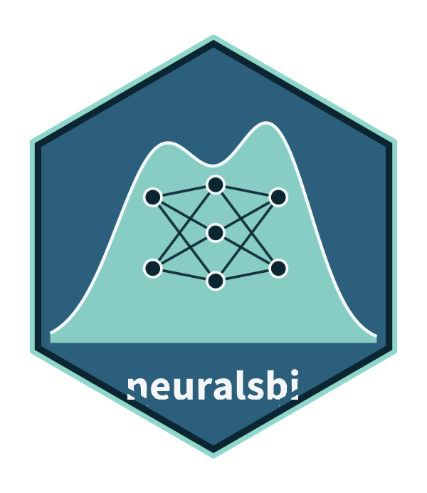

<!-- README.md is generated from README.Rmd. Please edit that file, then run rmarkdown::render("README.Rmd"). -->

```{r, include = FALSE}
knitr::opts_chunk$set(
  collapse = TRUE,
  comment = "#>",
  fig.path = "man/figures/README-",
  out.width = "100%"
)
```

# neuralsbi 

<!-- badges: start -->
[](https://github.com/pedroliman/neuralsbi/actions/workflows/R-CMD-check.yaml)
[](https://neuralsbi.pedrodelima.com/)
<!-- badges: end -->

`neuralsbi` brings [neural simulation-based inference](https://simulation-based-inference.org) (SBI) to R. Given a prior over parameters and a simulator, it trains a neural network to approximate the Bayesian posterior `p(theta | x)`: amortized, likelihood-free Bayesian inference, with no likelihood function and no Python. It mirrors the workflow of the Python [`sbi`](https://github.com/sbi-dev/sbi) package, but is a native R implementation: the neural density estimators for posterior estimation (mixture density networks, masked autoregressive flows, neural spline flows) run directly on the [`torch`](https://torch.mlverse.org/) R package (libtorch), not through a Python bridge.


It targets applied researchers rather than ML engineers: a familiar prior/simulator/posterior workflow, sensible defaults, and built-in posterior diagnostics: simulation-based calibration, expected coverage, TARP, and posterior predictive checks.

## Installation

```r
# install.packages("remotes")
remotes::install_github("pedroliman/neuralsbi")

# the neural back end (once)
install.packages("torch")
torch::install_torch()
```

## Usage

Simulation-based inference fits a posterior from a prior and a simulator, with no likelihood required. To keep the first example concrete, here is a textbook SIR epidemic model, solved as an ODE: a population of size `N` moves from Susceptible to Infected at transmission rate `Beta`, and from Infected to Recovered at rate `gamma`. Given `Beta` and `gamma`, solving the ODE deterministically produces one epidemic curve — we know the rates that generated it, so we can confirm the posterior recovers them.

A simulator here is a function of one parameter set that returns one simulated data set. Whatever else it needs — a covariate, a time grid, a population size — goes in `sim_args`. See `?nsbi_simulator`.

```{r usage, message = FALSE, warning = FALSE}
library(neuralsbi)
library(deSolve)   # install.packages("deSolve")

# The SIR ODE. R is implied (N - S - I) and never used, so only S and I are
# tracked. Defined once, at top level, and reused by simulator() below rather
# than rebuilt on every one of the thousands of calls npe() makes to it.
ode_model <- function(t, y, p) {
  with(as.list(c(y, p)), {
    dS <- -Beta * S * I / N
    dI <-  Beta * S * I / N - gamma * I
    list(c(dS, dI))
  })
}

# Observation design: infection counts read off the curve at 10 time points.
times    <- seq(5, 60, length.out = 10)
sim_args <- list(times = times, N = 1000, I0 = 5)

# Simulator: one parameter set in, one simulated epidemic curve out. theta
# arrives as a single named vector rather than one scalar argument per
# parameter — neuralsbi accepts either convention (see ?nsbi_simulator) and
# picks it up from the simulator's formals automatically.
simulator <- function(theta, times, N, I0) {
  ode(c(S = N - I0, I = I0), c(0, times), ode_model,
      c(Beta = theta[["Beta"]], gamma = theta[["gamma"]], N = N))[-1, "I"]
}

# Priors over the transmission and recovery rates.
prior <- prior_uniform(low = c(Beta = 0.1, gamma = 0.05), high = c(Beta = 1, gamma = 0.5))
fit   <- npe(prior, simulator, n_simulations = 3000, sim_args = sim_args, seed = 1)

# Simulate one epidemic from known rates, then infer them back. theta_true is
# named to match, so do.call() unpacks it straight into one call — the same
# convention npe() uses internally to dispatch a parameter set. Those names
# carry through to fit, to draws, and to the plots below with nothing to keep
# in sync by hand.
theta_true <- c(Beta = 0.4, gamma = 0.15)
y_obs      <- do.call(simulator, c(list(theta_true), sim_args))
post       <- posterior(fit, x_obs = y_obs)
draws      <- sample(post, 10000)
```

The posterior mean recovers the rates that generated the epidemic:

```{r recovery}
rbind(truth = theta_true, posterior_mean = colMeans(draws))
```

```{r pairplot, fig.alt = "Pairwise posterior over the SIR transmission and recovery rates."}
pairplot(draws, truth = theta_true)
```

The same posterior gives a point estimate; calibration checks such as simulation-based calibration live in `vignette("diagnostics")`.

```{r diagnostics, message = FALSE, warning = FALSE}
map_estimate(post)     # posterior mode
```

If you're interested in sbi in other languages or functionality not available here, see the [awesome neural SBI repo](https://github.com/smsharma/awesome-neural-sbi); there are some good implementations in python and in Julia.

## Running the simulator in parallel

Simulation is usually the expensive part of a fit, and it is embarrassingly parallel. Declare a [`future`](https://future.futureverse.org) plan and every function that calls your simulator — `npe()`, `simulate_for_sbi()`, `npe_sequential()`, `sbc()`, `tarp()`, `posterior_predictive()` — spreads the work across cores:

```r
library(future)
plan(multisession)

fit <- npe(prior, simulator, n_simulations = 10000)
```

There is nothing else to change: no extra argument, no parallel variant of `npe()`. Without a plan everything runs sequentially, as before. Each simulation draws from its own random-number stream, so a given `set.seed()` gives the same results on one core or on 32.

Simulation and neural training both report a progress bar with an ETA — one step per simulation, then one step per training epoch. If you use [`progressr`](https://progressr.futureverse.org), `neuralsbi` speaks it natively (`handlers(global = TRUE)`); if not, it draws its own bar. See `?nsbi_parallel` and `?nsbi_progress`.

## Learn more

The [package website](https://neuralsbi.pedrodelima.com/) has six vignettes that build on each other:

1. [Introduction to neural SBI](https://neuralsbi.pedrodelima.com/articles/intro-to-sbi.html) — what SBI is for, on a simulator whose likelihood has no closed form.
2. [Getting started](https://neuralsbi.pedrodelima.com/articles/neuralsbi.html) — the core prior/simulator/posterior workflow.
3. [Choosing a density estimator](https://neuralsbi.pedrodelima.com/articles/density-estimators.html) — MDN, MAF, NSF, and the torch-free baseline.
4. [Checking the posterior](https://neuralsbi.pedrodelima.com/articles/diagnostics.html) — calibration and predictive diagnostics.
5. [Comparison with pomp: an SIR epidemic model](https://neuralsbi.pedrodelima.com/articles/sir-epidemic.html) — neural posterior estimation and pomp's particle-filter MCMC on the same stochastic epidemic.
6. [Amortized R(t) across all US states](https://neuralsbi.pedrodelima.com/articles/sir-time-varying-beta.html) — three time-varying-beta models fit once each, then conditioned on 51 case curves.

## License

MIT
