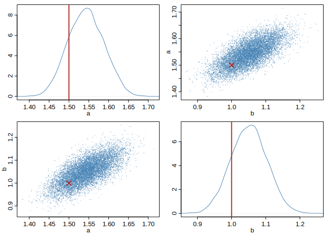

<!-- README.md is generated from README.Rmd. Please edit that file, then run rmarkdown::render("README.Rmd"). -->

# neuralsbi

<!-- badges: start -->

[](https://github.com/pedroliman/neuralsbi/actions/workflows/R-CMD-check.yaml)
[](https://pedroliman.github.io/neuralsbi/)
<!-- badges: end -->

`neuralsbi` is an R-native package for [Neural Simulation-based
inference](https://simulation-based-inference.org).

Neural estimators are implemented directly in R on the
[`torch`](https://torch.mlverse.org/) R package.

## Installation

``` r
# install.packages("remotes")
remotes::install_github("pedroliman/neuralsbi")

# the neural back end (once)
install.packages("torch")
torch::install_torch()
```

## Usage

Simulation-based inference recovers parameters from a model you can
simulate but whose likelihood you would rather not write down. To make
that concrete, take a noisy exponential decay measured at ten time
points — a cooling object, a clearing drug — with an amplitude `a` and a
decay rate `b` to recover. We know the parameters that generated the
data, so we can check that the posterior lands on them.

``` r
library(neuralsbi)
set.seed(1)

# Simulator: given (a, b), measure the decay curve a * exp(-b * t) at ten times,
# with observation noise. It only generates data — no fitting happens here.
times     <- seq(0, 2, length.out = 10)
simulator <- function(theta) {
  t(apply(theta, 1, function(p) p[1] * exp(-p[2] * times) + rnorm(length(times), sd = 0.05)))
}

# Prior over the amplitude and decay rate, then train the neural posterior.
prior <- prior_uniform(low = c(0, 0), high = c(3, 3))
fit   <- npe(prior, simulator, n_simulations = 3000, seed = 1)

# Measure one curve from known parameters, then infer them back.
theta_true <- c(a = 1.5, b = 1.0)
x_obs      <- simulator(rbind(theta_true))
post       <- posterior(fit, x_obs = x_obs)
draws      <- sample(post, 10000)
```

The posterior mean recovers the parameters that generated the curve:

``` r
rbind(truth = theta_true, posterior_mean = colMeans(draws))
#>                       a        b
#> truth          1.500000 1.000000
#> posterior_mean 1.543212 1.050659
```

``` r
pairplot(draws, truth = theta_true, labels = c("a", "b"))
```



The same posterior gives a point estimate; calibration checks such as
simulation-based calibration live in `vignette("diagnostics")`.

``` r
map_estimate(post)     # posterior mode
#> [1] 1.539072 1.048587
```

If you’re interested in sbi in other languages or functionality not
available here, see the [awesome neural SBI
repo](https://github.com/smsharma/awesome-neural-sbi); there are some
good implementations in python and in Julia.

## Learn more

The [package website](https://pedroliman.github.io/neuralsbi/) has four
vignettes that build on each other:

1.  [Getting
    started](https://pedroliman.github.io/neuralsbi/articles/neuralsbi.html)
    — the core prior/simulator/posterior workflow.
2.  [Choosing a density
    estimator](https://pedroliman.github.io/neuralsbi/articles/density-estimators.html)
    — MDN, MAF, NSF, and the torch-free baseline.
3.  [Checking the
    posterior](https://pedroliman.github.io/neuralsbi/articles/diagnostics.html)
    — calibration and predictive diagnostics.
4.  [Case study: an SIR epidemic
    model](https://pedroliman.github.io/neuralsbi/articles/sir-epidemic.html)
    — the full Bayesian workflow on an applied problem.

## License

MIT
