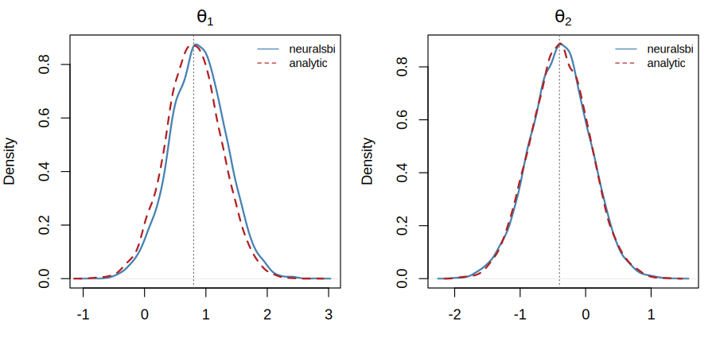
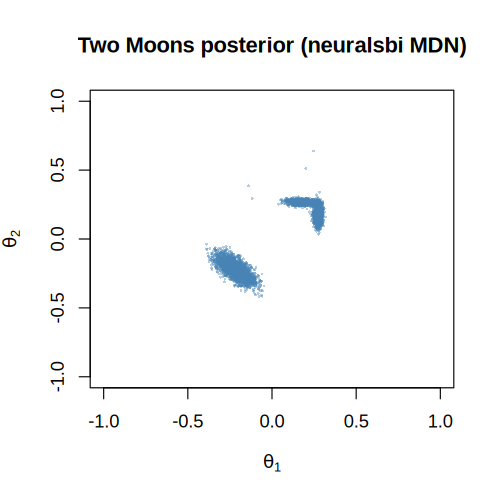

# neuralsbi

**Neural simulation-based inference in R — Neural Posterior Estimation (NPE).**

`neuralsbi` lets you do Bayesian inference when you have a *simulator* and a
*prior* but **no tractable likelihood**. You give it a prior and a function that
turns parameters into simulated data; it trains a neural conditional density
estimator and hands back a posterior you can sample from, evaluate, and check.

It is a **native R** implementation of the ideas in the excellent Python
[`sbi`](https://github.com/sbi-dev/sbi) package — modeled on its workflow, but
**not a wrapper**. Neural density estimators run on the
[`torch`](https://torch.mlverse.org/) R package (libtorch C++ bindings), so
there is no Python dependency. A closed-form estimator is also included and needs
no `torch` at all.

> Status: **v0.1 pilot.** Amortized single-round NPE with a Mixture Density
> Network and a linear-Gaussian baseline, plus diagnostics. See
> [`docs/implementation-plan.md`](docs/implementation-plan.md) and
> [`docs/verification-roadmap.md`](docs/verification-roadmap.md).

## Installation

```r
# 1. the package
# install.packages("remotes")
remotes::install_github("pedroliman/neural.sbi")

# 2. the neural back end (once)
install.packages("torch")
torch::install_torch()
```

Don't want `torch`? You can still use `density_estimator = "linear_gaussian"`.

## Quick start

```r
library(neuralsbi)

# 1. a prior over parameters
prior <- prior_uniform(low = c(-2, -2, -2), high = c(2, 2, 2))

# 2. a simulator: parameters (n x d matrix) -> data (n x k matrix)
simulator <- function(theta) {
  theta + 1 + matrix(rnorm(length(theta), sd = 0.1), nrow = nrow(theta))
}

# 3. train an amortized posterior
fit <- npe(prior, simulator, n_simulations = 2000)

# 4. condition on an observation and sample
post   <- posterior(fit, x_obs = c(0.8, 0.6, 0.4))
draws  <- sample(post, 10000)

pairplot(draws)                 # visualize
map_estimate(post)              # point estimate
log_prob(post, c(0, 0, 0))      # posterior density
```

The API deliberately echoes `sbi`:

| Python `sbi` | `neuralsbi` |
|---|---|
| `prior = BoxUniform(low, high)` | `prior <- prior_uniform(low, high)` |
| `NPE(prior).append_simulations(theta, x).train()` | `npe(prior, theta = theta, x = x)` |
| `posterior = inference.build_posterior()` | `post <- posterior(fit)` |
| `posterior.sample((n,), x=x_o)` | `sample(post, n, obs = x_o)` |
| `posterior.log_prob(theta, x=x_o)` | `log_prob(post, theta, x = x_o)` |

## Checking your posterior

Good inference means *calibrated* inference. `neuralsbi` ships the standard
checks:

```r
res <- sbc(fit, simulator, n_sbc = 300)   # simulation-based calibration
plot_sbc(res)                             # rank histogram (flat = calibrated)
expected_coverage(res)                    # nominal vs empirical coverage

# compare two posteriors (e.g. yours vs a reference) — ~0.5 means identical
c2st(draws_a, draws_b)
```

## Density estimators

- `"mdn"` (default) — a **Mixture Density Network**: a neural net that outputs a
  Gaussian mixture over parameters. Handles non-Gaussian, multimodal posteriors
  (see `inst/examples/two_moons.R`). Requires `torch`.
- `"linear_gaussian"` — a **closed-form** conditional Gaussian. No neural net, no
  `torch`; *exact* for linear-Gaussian models, great as a fast baseline.

Normalizing flows (MAF, NSF), embedding networks, and sequential NPE are on the
[roadmap](docs/verification-roadmap.md).

## How is this verified?

The linear-Gaussian model has an analytic posterior, so we test against the exact
answer: estimated posterior mean/sd match, and a classifier two-sample test
(C2ST) between our samples and analytic samples sits at ≈ 0.5. The roadmap adds
head-to-head comparisons against Python `sbi` on the `sbibm` benchmark suite.

**The MDN posterior overlays the analytic posterior** on the linear-Gaussian
task (C2ST ≈ 0.53 vs. analytic):



**And it recovers genuinely non-Gaussian, bimodal posteriors** — here the classic
two-moons task, whose posterior has two symmetric modes:



Reproduce both with `Rscript inst/examples/pilot_demo.R`.

## License

MIT.
