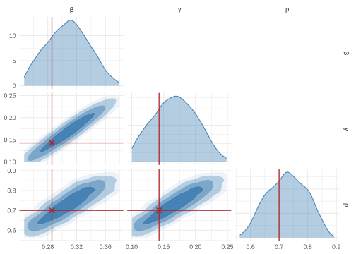
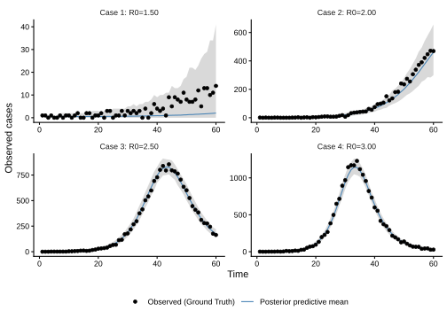

<!-- README.md is generated from README.Rmd. Please edit that file, then run rmarkdown::render("README.Rmd"). -->

# neuralsbi 

<!-- badges: start -->

[](https://github.com/pedroliman/neuralsbi/actions/workflows/R-CMD-check.yaml)
[](https://neuralsbi.pedrodelima.com/)
[](https://doi.org/10.5281/zenodo.21540271)
<!-- badges: end -->

`neuralsbi` implements [neural simulation-based
inference](https://simulation-based-inference.org) (SBI) methods
directly in R. Given a prior over parameters and a simulator, it trains
a neural network to approximate the Bayesian posterior $p(\theta | x)$.
The neural density estimators for posterior estimation (mixture density
networks, masked autoregressive flows, neural spline flows) run directly
on the [`torch`](https://torch.mlverse.org/) R package (libtorch). You
don’t need python or Julia to use `neuralsbi`.

## Installation

``` r
# install.packages("remotes")
remotes::install_github("pedroliman/neuralsbi")

# the neural back end (once)
install.packages("torch")
torch::install_torch()
```

## Usage

All you need to provide `neuralsbi` is a simulator that takes a vector
of parameters, other inputs it needs and returns a vector of outcomes.
Unlike in stan where you need to provide a likelihood function, here you
only need to simulate your data generation process.

In this example, we create an SIR model, where only a fraction $\rho$ of
cases is observed. Parameters to be fit are $\beta$ and $\gamma$. We
know in this example that the quantity that is better identified by the
model is $R_0=\beta/\gamma$, but that is fine. In a real-world
application, we would constrain $\gamma$ given external information.

### Define your simulator:

``` r
library(neuralsbi)
library(deSolve)   # install.packages("deSolve")
library(future)
library(dplyr)
library(ggplot2)


# Set up ------------------------------------------------------------------

# An SIR ODE:
ode_model <- function(t, y, p) {
  with(as.list(c(y, p)), {
    dS <- -beta * S * I / N
    dI <-  beta * S * I / N - gamma * I
    dCumInfections <- beta * S * I / N
    list(c(dS, dI, dCumInfections))
  })
}

# Simulator function
# Here we are already only making the simulator return only 10 observations
my_simulator <- function(theta, times = 0:60, N = 100000, I0 = 5) {
  # Let's use just a deterministic ODE, so there's no randomness in transmission:
  # WE could make it fully stochastic if we want. 
  # I just want to make this as fast as it can be for this vignette build
  ode_result <- ode(y = c(S = N - I0, I = I0, CumInfections = 0),
                    times = times,
                    func = ode_model,
                    parms = c(beta = theta[["beta"]],
                              gamma = theta[["gamma"]],
                              N = N))
  
  cases <- round(diff(ode_result[, "CumInfections"]))
  obs_cases <- rbinom(n = length(cases), size= cases, prob = theta[["rho"]])
  
  # return output vector
  return(obs_cases)
}

# test simulator, returns a time-series of two months of data
my_simulator(theta=c(beta = 0.5, gamma = 1/7, rho = 0.5))
#>  [1]    0    3    3    4    5    9   11   20   26   39   51   79  110  163  229
#> [16]  293  397  578  831 1137 1495 1914 2530 2926 3388 3752 3806 3703 3515 3062
#> [31] 2639 2197 1793 1427 1133  894  716  591  498  376  349  258  210  185  142
#> [46]  136  107   92   76   72   62   44   49   38   23   27   29   18   15   17
```

### Train your neural posterior estimator

Now we train our neural posterior estimator with the `npe` function. We
need just a prior over which we will train the model. It takes about a
minute to train it with 5,000 runs, which is a modest simulation budget.

``` r
# Set up our priors
prior <- prior_uniform(low = c(beta = 0.1, gamma = 1/10, rho = 0.1),
                       high = c(beta = 0.7, gamma = 1/4, rho = 0.9))

# Set up parallel simulations:
plan(multisession, workers = 8)

# Observation times: the simulator returns I at these points.
times <- 0:60
sim_args <- list(times = times, N = 100000, I0 = 5)

# Here we fit the neural posterior estimator with neuralsbi's npe function:

fit   <- npe(prior, my_simulator, n_simulations = 5000, sim_args = sim_args, seed = 1)

fit
#> <nsbi_npe> Neural Posterior Estimation fit
#>   density estimator : maf
#>   parameters (dim)  : 3
#>     names           : beta, gamma, rho 
#>   data (dim)        : 60
#>   simulations       : 5000
#>   best val loss     : -2.4076
#>   -> build a posterior with posterior(fit, x_obs = ...)
```

Looks like it works. We don’t know if it is any good yet, let’s see!

### Condition on your data to get a posterior distribution

Now, let’s create some data with the model. Let’s say there’s an
outbreak that looks like COVID-19, with $R_0=2.5$ and a recovery rate
$\gamma = 1/7$. Note that our neural posterior estimator *hasn’t seen
any data yet*. We get a posterior by calling the `posterior` function on
our `npe` and giving it a data vector. The `posterior` call is fast.

``` r
true_r0 = 2
true_gamma = 1/7
true_params <- c(beta = true_r0 * true_gamma, gamma = true_gamma, rho = 0.7)

# Make some data (or read in your data)
y_obs   <- my_simulator(true_params, times = times, N = 100000, I0 = 5)

# Get posterior - this is instantaneous.
post <- posterior(fit, x_obs = y_obs)

post_draws <- sample(post, 1000)

pairplot(post_draws, true_params)
```



Our posterior distribution covers our ground-truth value. We knew that
the SIR model posterior was a ridge; no surprises there. We can still
get some identification from this data; that’s nice.

### Posterior Predictive Distribution

Now, what if $R_0$ was lower, or higher? Does this machinery still work?
Also, how do you fit the model to multiple data sets, like multiple
cities?

Thanks to neural poesterior estimation, that is no problem. We can just
condition again on new data and get a new posterior. Let’s do that on a
loop for a few values of $R_0$ and do a posterior predictive
distribution test. If everything is working we should be able to
estimate the model anywhere in the parameter space that we used as a
prior.

``` r


# Set gamma fixed and let beta vary
set.seed(42)
R0s <- c(1.5, 2, 2.5, 3)
gamma <- rep(1/7,4)
beta <- R0s * gamma
rho <- rep(0.2, 4)
theta_grid <- matrix(data = c(beta, gamma, rho), nrow = 4, dimnames = list(1:4, c("beta", "gamma", "rho")))


# For each drawn theta: simulate an observation, condition the (single) fit on
# it, then build a posterior-predictive band. Everything reuses `fit`.
pp_summary <- do.call(rbind, lapply(seq_len(nrow(theta_grid)), function(i) {
  
  theta_i <- theta_grid[i, ]
  R0_i <- R0s[i]
  y_obs   <- my_simulator(theta_i, times = times, N = 100000, I0 = 5)

  post <- posterior(fit, x_obs = y_obs)
  pp   <- posterior_predictive(post, my_simulator, 1000)

  data.frame(
    obs_id = sprintf("Case %d: R0=%.2f",
                     i, R0_i),
    time   = times[-1],
    mean   = colMeans(pp),
    lower  = apply(pp, 2, quantile, probs = 0.005),
    upper  = apply(pp, 2, quantile, probs = 0.995),
    obs    = y_obs
  )
}))

# Posterior predictive plot
pp_plot <- ggplot(pp_summary, aes(x = time)) +
  geom_ribbon(aes(ymin = lower, ymax = upper, fill = "Posterior predictive 90%"),
              alpha = 0.3) +
  geom_line(aes(y = mean, colour = "Posterior predictive mean")) +
  geom_point(aes(y = obs, colour = "Observed (Ground Truth)")) +
  facet_wrap(~ obs_id, nrow = 2, ncol = 2, scales = "free_y", axes = "all") +
  scale_colour_manual(values = c("Observed (Ground Truth)" = "black",
                                 "Posterior predictive mean" = "steelblue")) +
  scale_fill_manual(values = c("Posterior predictive 99%" = "steelblue")) +
  labs(x = "Time", y = "Observed cases", colour = NULL, fill = NULL) +
  theme_classic() + 
  theme(legend.position = "bottom", strip.background = element_blank())

pp_plot
#> Warning: No shared levels found between `names(values)` of the manual scale and the
#> data's fill values.
#> No shared levels found between `names(values)` of the manual scale and the
#> data's fill values.
```



Note we didn’t have to re-run the estimation process to do this. We just
needed to call `post <- posterior(fit, x_obs = y_obs)` then get our
posterior predictive distribution with
`posterior_predictive(post, my_simulator, 1000)`.

Isn’t neural SBI awesome? Go tell your friends that neural
simulation-based inference is awesome.

## Learn more

The [package website](https://neuralsbi.pedrodelima.com/) has some more
documentation.

## License

MIT
