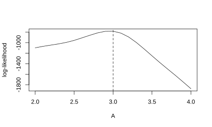
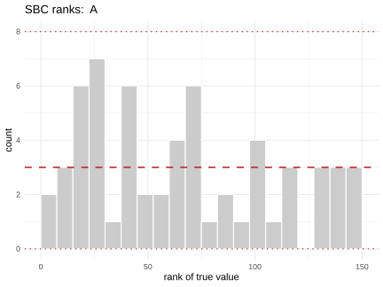
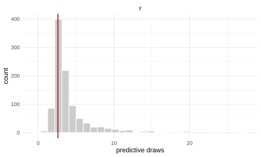

# Neural likelihood estimation, and handing it to Stan

``` r

library(neuralsbi)
#> 
#> Attaching package: 'neuralsbi'
#> The following object is masked from 'package:base':
#> 
#>     sample
```

[`npe()`](https://neuralsbi.pedrodelima.com/reference/npe.md) learns the
posterior directly. That is the right default, and most of this
package’s documentation is about it. This article is about the case
where it is the wrong default.

Suppose your data are $`n`$ independent measurements of the same
underlying parameter: 200 assay readings, 500 trial outcomes, a month of
daily counts. An NPE fit takes a fixed-length $`x`$ and returns
$`p(\theta | x)`$, and that length is decided when the network is
trained. Collect 300 measurements instead of 200 and the fit no longer
applies. You retrain, or you compress the data into a few summary
statistics and accept whatever they throw away.

[`nle()`](https://neuralsbi.pedrodelima.com/reference/nle.md) learns the
likelihood of a single observation, $`q_\phi(x | \theta)`$. Independent
observations multiply, so their log-likelihoods add:

``` math
\log p(x_1, \ldots, x_n | \theta) = \sum_{i=1}^{n} \log q_\phi(x_i | \theta).
```

Train once, then condition on however many observations you happen to
have. The price is that the posterior is no longer a forward pass:
$`q_\phi(x | \theta)`$ is a likelihood, and turning it into a posterior
takes MCMC.

## A model whose likelihood you cannot write down

The g-and-k distribution is the standard test case for this situation,
and a good one, because the awkwardness is real rather than contrived.
It is defined by its quantile function:

``` math
Q(u) = A + B\left(1 + c\,\frac{1 - e^{-g z(u)}}{1 + e^{-g z(u)}}\right)\left(1 + z(u)^2\right)^{k} z(u), \qquad z(u) = \Phi^{-1}(u).
```

$`A`$ and $`B`$ set location and scale, $`g`$ controls skewness, $`k`$
controls tail weight, and $`c`$ is conventionally fixed at 0.8.
Simulating is trivial: draw a uniform and push it through $`Q`$. Writing
down the density is not, because $`Q`$ has no closed-form inverse. So
the model is easy to simulate and impossible to fit by ordinary maximum
likelihood, which is exactly the situation SBI is for.

``` r

rgk <- function(u, A, B, g, k, c = 0.8) {
  z <- qnorm(u)
  A + B * (1 + c * (1 - exp(-g * z)) / (1 + exp(-g * z))) *
    (1 + z^2)^k * z
}

# One call, one observation: the contract nle() and npe() share.
simulator <- function(A, B, g, k) {
  c(y = rgk(runif(1), A, B, g, k))
}

prior <- prior_uniform(low  = c(A = 0, B = 0, g = 0, k = 0),
                       high = c(A = 10, B = 10, g = 4, k = 1))
```

## Look at the prior predictive first

The ABC literature usually puts $`g`$ and $`k`$ on $`[0, 10]`$ along
with the other two. Both are bad ideas here, and simulating from the
prior says so before any training happens. Start with $`k`$:

``` r

wide <- prior_uniform(low  = c(A = 0, B = 0, g = 0, k = 0),
                      high = c(A = 10, B = 10, g = 10, k = 10))

quantile(abs(simulate_for_sbi(simulator, wide, 5000, seed = 1)$x),
         c(0.5, 0.99, 1))
#>          50%          99%         100% 
#> 1.080501e+01 2.391925e+07 1.237661e+11
quantile(abs(simulate_for_sbi(simulator, prior, 5000, seed = 1)$x),
         c(0.5, 0.99, 1))
#>        50%        99%       100% 
#>   6.040338  78.061778 379.911342
```

$`k`$ is the tail-weight parameter and it enters as $`(1 + z^2)^k`$, so
$`k = 10`$ puts simulated values around $`10^{12}`$ while $`k = 0.5`$
puts them around 10. A density estimator standardizes its training data
once, and no single scale covers twelve orders of magnitude. The fit
would be dominated by a handful of enormous draws and useless everywhere
else. Restricting $`k`$ to $`[0, 1]`$ keeps the tails interesting and
the problem well posed.

$`g`$ fails the opposite way. It enters through
$`(1 - e^{-gz}) / (1 + e^{-gz})`$, which is a tanh in disguise and
saturates. Once $`g`$ is past about 4 the simulated distribution stops
changing.

``` r

u <- runif(200000)
shift <- sapply(c(1, 2, 3, 4, 6, 10), function(g)
  quantile(rgk(u, A = 3, B = 1, g = g, k = 0.5), c(0.1, 0.25, 0.75, 0.9)))
colnames(shift) <- paste0("g=", c(1, 2, 3, 4, 6, 10))
round(shift, 3)
#>       g=1   g=2   g=3   g=4   g=6  g=10
#> 10% 1.858 2.344 2.513 2.563 2.581 2.583
#> 25% 2.396 2.568 2.685 2.755 2.814 2.835
#> 75% 4.023 4.194 4.310 4.380 4.440 4.461
#> 90% 6.007 6.491 6.660 6.710 6.729 6.730
```

The quantiles move by 0.7 per unit of $`g`$ between 1 and 2, and by
0.005 per unit between 6 and 10. A prior of $`[0, 10]`$ therefore spends
more than half its range on values the data cannot tell apart, and the
estimator spends its capacity learning that nothing happens there.
Worse, a likelihood that is flat in a parameter over most of its prior
is one whose surrogate is nearly flat, and the difference between the
two is noise the sampler will happily chase. Putting $`g`$ on $`[0, 4]`$
keeps the part that is identified.

This is worth doing before every fit, not just this one. A prior
predictive check costs a few seconds of simulation and catches the class
of problem that otherwise shows up as an inexplicably bad posterior, or
as chains that will not mix.

## Train the surrogate likelihood

``` r

fit <- nle(prior, simulator, n_simulations = 50000,
           density_estimator = "mdn", n_components = 10, seed = 1)
fit
#> <nsbi_nle> Neural Likelihood Estimation fit
#>   density estimator : mdn  (learns q(x | theta))
#>   parameters (dim)  : 4
#>     names           : A, B, g, k 
#>   data (dim)        : 1  per observation
#>     names           : y 
#>   simulations       : 50000
#>   best val loss     : 0.1176
#>   -> log_lik(fit, theta, x), posterior(fit, x_obs = ...), stan_code(fit)
```

Fifty thousand simulations of a four-parameter model, each producing a
single scalar. That is a modest budget by SBI standards, and it goes
further here than it would for NPE, because the estimator is learning a
one-dimensional conditional density rather than a four-dimensional
posterior.

The estimator is an MDN rather than the package default MAF, and the
reason is worth knowing. An MDN maps $`\theta`$ to the parameters of a
Gaussian mixture over $`x`$, and the network never sees $`x`$ at all. So
for $`n`$ independent observations the network runs once and all $`n`$
densities are read off the same mixture. A flow’s transforms depend on
$`x`$ as well as $`\theta`$, so it has to run $`n`$ times. On this model
at 5000 observations a slice step costs about seven times more with a
MAF than with the MDN, which is the difference between a posterior that
takes a minute and one that takes ten. `neuralsbi` takes the shortcut
automatically when the estimator allows it. Choose `"maf"` when the
conditional density is shaped in a way a mixture cannot follow and you
can afford the passes.

The fitted likelihood is a plain function, and
[`likelihood_fn()`](https://neuralsbi.pedrodelima.com/reference/likelihood_fn.md)
hands it over as one:

``` r

theta_true <- c(A = 3, B = 1, g = 2, k = 0.5)
x_obs <- matrix(rgk(runif(500), 3, 1, 2, 0.5), ncol = 1)

loglik <- likelihood_fn(fit, x_obs)
loglik(theta_true)
#> [1] -783.0119

# Nothing downstream needs to know about neuralsbi.
profile_A <- sapply(seq(2, 4, by = 0.1), function(a) {
  loglik(c(a, theta_true[2:4]))
})
plot(seq(2, 4, by = 0.1), profile_A, type = "l",
     xlab = "A", ylab = "log-likelihood")
abline(v = 3, lty = 2)
```



plot of chunk loglik

## One fit, any number of observations

This is the payoff. The same `fit` conditions on 50 observations, 500,
or 5000, with no retraining:

``` r

x_all <- matrix(rgk(runif(5000), 3, 1, 2, 0.5), ncol = 1)

draws <- lapply(c(50, 500, 5000), function(n) {
  post <- posterior(fit, x_all[seq_len(n), , drop = FALSE],
                    n_chains = 20, warmup = 500, seed = 2)
  sample(post, 8000)
})
names(draws) <- c("n = 50", "n = 500", "n = 5000")

t(sapply(draws, colMeans))
#>                 A        B        g         k
#> n = 50   3.361437 1.819317 2.446080 0.3563905
#> n = 500  3.104044 1.136909 1.822757 0.6066267
#> n = 5000 3.068538 1.073896 1.690570 0.6052047
t(sapply(draws, function(d) apply(d, 2, sd)))
#>                   A          B          g          k
#> n = 50   0.24783002 0.43942949 0.71211816 0.14812811
#> n = 500  0.07774668 0.08218999 0.34056131 0.04239406
#> n = 5000 0.01988842 0.02115621 0.06665379 0.01171446
```

The posterior contracts as the observations accumulate, which is what it
should do and what an NPE fit trained at one $`n`$ cannot show you.

``` r

cols <- c("grey60", "steelblue", "firebrick")

op <- par(mfrow = c(2, 2), mar = c(4, 4, 2, 1))
for (j in 1:4) {
  dens <- lapply(draws, function(d) density(d[, j]))
  plot(dens[[1]], main = colnames(draws[[1]])[j], xlab = "", col = cols[1],
       ylim = c(0, max(sapply(dens, function(d) max(d$y)))))
  for (i in 2:3) lines(dens[[i]], col = cols[i])
  abline(v = theta_true[j], lty = 2)
  if (j == 1) legend("topright", names(draws), col = cols, lty = 1, bty = "n")
}
```


plot of chunk contraction

``` r

par(op)
```

The dashed line is the truth. Each posterior is narrower than the last,
and none of them required a second fit.

### The part nobody tells you about

Now compare each posterior against the truth in the units the posterior
itself is quoting, its own standard deviations:

``` r

z_score <- t(sapply(draws, function(d) {
  (colMeans(d) - theta_true) / apply(d, 2, sd)
}))
round(z_score, 1)
#>            A   B    g    k
#> n = 50   1.5 1.9  0.6 -1.0
#> n = 500  1.3 1.7 -0.5  2.5
#> n = 5000 3.4 3.5 -4.6  9.0
```

The absolute errors are small and mostly getting smaller. The numbers
above are not, because the posterior narrows faster than the error does.
By $`n = 5000`$ every parameter lands several standard deviations from
the truth, and says so with complete confidence.

This is not a bug and it is not the sampler. Stan’s NUTS, further down,
lands on the same posterior from an entirely different algorithm. It is
the arithmetic of the sum this whole article is built on. Suppose the
surrogate is wrong by an average of $`\epsilon`$ nats per observation in
some direction of parameter space. The log-likelihood of $`n`$
observations is off by $`n\epsilon`$, while the information the data
carry about the parameter also grows like $`n`$. The two race each
other, and which one wins is set by how good the surrogate is, not by
how much data you have. Past some $`n`$, more observations buy you a
tighter posterior around the surrogate’s error rather than around the
truth.

There is no $`n`$ at which this becomes visible on its own: at every one
of them the posterior looks like a perfectly ordinary posterior. What
gives it away is the comparison across $`n`$. An interval that keeps
shrinking without ever moving toward anything is an interval converging
on the estimator rather than on the parameter. The fix is a better
surrogate, not more data: more simulations, a more flexible estimator,
or a narrower prior that lets the estimator spend its capacity where the
data are.

Simulation-based calibration, below, sees only half of this. Each SBC
trial draws a single observation, so it validates the estimator at
$`n = 1`$. It can tell you the surrogate is already miscalibrated there,
and further down it does exactly that for $`k`$. What it cannot tell you
is how far that error travels once it is summed over five thousand
observations, because it never sums anything. Comparing posteriors
across $`n`$, as we just did, is the check that sees the second half.

## What the sampler did

[`sample()`](https://neuralsbi.pedrodelima.com/reference/sample.md) on
an NLE posterior runs a vectorized slice sampler, and reports what
happened rather than leaving you to trust it:

``` r

post_500 <- posterior(fit, x_all[1:500, , drop = FALSE],
                      n_chains = 20, warmup = 500, seed = 2)
d500 <- sample(post_500, 8000)
attr(d500, "diagnostics")
#>       rhat  ess_bulk
#> A 1.022598  662.6971
#> B 1.023026 1154.1432
#> g 1.033257  575.6867
#> k 1.011480 2209.0063
```

`rhat` compares the spread within each chain against the spread across
them, so a value near 1 says the 20 chains have found the same
distribution. `ess_bulk` says how many independent draws the retained
ones are worth. Read both before reading the posterior.

This target does not give you 1.00. A surrogate likelihood summed over
five hundred observations is a rugged thing to sample, and the numbers
above are what that looks like: `rhat` a few hundredths above 1, and an
effective sample size between a few hundred and a couple of thousand out
of eight thousand draws. That is the honest state of this run, and it is
the reason this article does not use the defaults. At `warmup = 300` and
2000 draws the same posterior reports `rhat` around 1.14.

Three levers, in the order worth trying them. Raise `warmup`, so the
chains have longer to find the mass and the slice width longer to adapt
to it. Ask for more draws, which costs proportionally and buys `rhat`
directly. Raise `thin`, which trades draws for independence when the
chains are moving but slowly. Each of those on this model takes the run
from seconds to minutes, not minutes to hours.

The fourth lever is the model, and it is the one that matters most. The
$`g`$ we did not narrow, back at the start, gave chains that never mixed
at all: a flat direction in the likelihood is not a sampling problem you
can spend your way out of. And when `rhat` lands where it does here
rather than at 1.5, the useful question is whether an independent
sampler agrees. NUTS on the same likelihood, below, lands on the same
posterior, which says the remaining `rhat` is a chain too short to prove
itself rather than chains in different places.

## Handing the likelihood to Stan

Everything so far stayed inside `neuralsbi`.
[`stan_code()`](https://neuralsbi.pedrodelima.com/reference/stan_export.md)
writes the fitted likelihood out as Stan source, so it does not have to:

``` r

cat(stan_code(fit, model = FALSE))
#> // Generated by neuralsbi::stan_code(). Do not edit by hand.
#> // Surrogate likelihood q(x | theta) from an nle() fit (mdn, 50000 simulations).
#> functions {
#>   vector nsbi_log_lik_relu(vector v) {
#>     vector[num_elements(v)] out;
#>     for (i in 1:num_elements(v)) out[i] = fmax(v[i], 0.0);
#>     return out;
#>   }
#> 
#>   // MLP head: mixture logits, means and Cholesky factors, all functions
#>   // of theta alone. Returned packed so the i.i.d. sum can hoist it out
#>   // of the observation loop.
#>   vector nsbi_log_lik_head(vector ts, vector w) {
#>     vector[50] h1 = nsbi_log_lik_relu(to_matrix(segment(w, 1, 200), 50, 4) * ts + segment(w, 201, 50));
#>     vector[50] h2 = nsbi_log_lik_relu(to_matrix(segment(w, 251, 2500), 50, 50) * h1 + segment(w, 2751, 50));
#>     return append_row(append_row(to_matrix(segment(w, 2801, 500), 10, 50) * h2 + segment(w, 3301, 10), to_matrix(segment(w, 3311, 500), 10, 50) * h2 + segment(w, 3811, 10)), to_matrix(segment(w, 3821, 500), 10, 50) * h2 + segment(w, 4321, 10));
#>   }
#> 
#>   real nsbi_log_lik_from_head(vector xs, vector head) {
#>     vector[10] logits = head[1:10];
#>     vector[10] mflat = head[11:20];
#>     vector[10] tflat = head[21:30];
#>     vector[10] lp;
#>     for (k in 1:10) {
#>       matrix[1, 1] L = rep_matrix(0.0, 1, 1);
#>       vector[1] mu = mflat[((k - 1) * 1 + 1):(k * 1)];
#>       {
#>         L[1, 1] = log1p_exp(tflat[(k - 1) * 1 + 1]) + 1e-6;
#>       }
#>       lp[k] = logits[k] + multi_normal_cholesky_lpdf(xs | mu, L);
#>     }
#>     return log_sum_exp(lp) - log_sum_exp(logits);
#>   }
#> 
#>   real nsbi_log_lik_lpdf(vector x, vector theta, vector w) {
#>     vector[1] xs = (x - [8.8893274325512426]') ./ [16.741656276369508]';
#>     vector[4] ts = (theta - [5.0028162992720491, 4.989676804957166, 1.9967429687478766, 0.50097727076713461]') ./ [2.8874993568662277, 2.9013129093596519, 1.1517685672968496, 0.28881718509330867]';
#>     return nsbi_log_lik_from_head(xs, nsbi_log_lik_head(ts, w)) - 2.8179000014076787;
#>   }
#> 
#>   real nsbi_log_lik_sum_lpdf(matrix x, vector theta, vector w) {
#>     vector[4] ts = (theta - [5.0028162992720491, 4.989676804957166, 1.9967429687478766, 0.50097727076713461]') ./ [2.8874993568662277, 2.9013129093596519, 1.1517685672968496, 0.28881718509330867]';
#>     vector[30] head = nsbi_log_lik_head(ts, w);
#>     vector[1] xc = [8.8893274325512426]';
#>     vector[1] xsc = [16.741656276369508]';
#>     real total = 0;
#>     for (n in 1:rows(x)) {
#>       total += nsbi_log_lik_from_head((x[n]' - xc) ./ xsc, head);
#>     }
#>     return total + rows(x) * (-2.8179000014076787);
#>   }
#> }
```

The generated `functions` block recomputes the mixture’s log-density in
Stan’s own language: the MLP as matrix multiplies and a relu, a softplus
on the Cholesky diagonal, then `log_sum_exp` over the components. The
trained weights arrive as `data` in the packed vector `w`, which is why
the block reads as a lot of `segment()` calls. Stan differentiates the
code itself, so NUTS gets exact gradients and nothing has to be linked
against `torch`.

A complete model comes with the prior and data blocks attached:

``` r

cat(stan_code(fit))
#> // Generated by neuralsbi::stan_code(). Do not edit by hand.
#> // Surrogate likelihood q(x | theta) from an nle() fit (mdn, 50000 simulations).
#> functions {
#>   vector nsbi_log_lik_relu(vector v) {
#>     vector[num_elements(v)] out;
#>     for (i in 1:num_elements(v)) out[i] = fmax(v[i], 0.0);
#>     return out;
#>   }
#> 
#>   // MLP head: mixture logits, means and Cholesky factors, all functions
#>   // of theta alone. Returned packed so the i.i.d. sum can hoist it out
#>   // of the observation loop.
#>   vector nsbi_log_lik_head(vector ts, vector w) {
#>     vector[50] h1 = nsbi_log_lik_relu(to_matrix(segment(w, 1, 200), 50, 4) * ts + segment(w, 201, 50));
#>     vector[50] h2 = nsbi_log_lik_relu(to_matrix(segment(w, 251, 2500), 50, 50) * h1 + segment(w, 2751, 50));
#>     return append_row(append_row(to_matrix(segment(w, 2801, 500), 10, 50) * h2 + segment(w, 3301, 10), to_matrix(segment(w, 3311, 500), 10, 50) * h2 + segment(w, 3811, 10)), to_matrix(segment(w, 3821, 500), 10, 50) * h2 + segment(w, 4321, 10));
#>   }
#> 
#>   real nsbi_log_lik_from_head(vector xs, vector head) {
#>     vector[10] logits = head[1:10];
#>     vector[10] mflat = head[11:20];
#>     vector[10] tflat = head[21:30];
#>     vector[10] lp;
#>     for (k in 1:10) {
#>       matrix[1, 1] L = rep_matrix(0.0, 1, 1);
#>       vector[1] mu = mflat[((k - 1) * 1 + 1):(k * 1)];
#>       {
#>         L[1, 1] = log1p_exp(tflat[(k - 1) * 1 + 1]) + 1e-6;
#>       }
#>       lp[k] = logits[k] + multi_normal_cholesky_lpdf(xs | mu, L);
#>     }
#>     return log_sum_exp(lp) - log_sum_exp(logits);
#>   }
#> 
#>   real nsbi_log_lik_lpdf(vector x, vector theta, vector w) {
#>     vector[1] xs = (x - [8.8893274325512426]') ./ [16.741656276369508]';
#>     vector[4] ts = (theta - [5.0028162992720491, 4.989676804957166, 1.9967429687478766, 0.50097727076713461]') ./ [2.8874993568662277, 2.9013129093596519, 1.1517685672968496, 0.28881718509330867]';
#>     return nsbi_log_lik_from_head(xs, nsbi_log_lik_head(ts, w)) - 2.8179000014076787;
#>   }
#> 
#>   real nsbi_log_lik_sum_lpdf(matrix x, vector theta, vector w) {
#>     vector[4] ts = (theta - [5.0028162992720491, 4.989676804957166, 1.9967429687478766, 0.50097727076713461]') ./ [2.8874993568662277, 2.9013129093596519, 1.1517685672968496, 0.28881718509330867]';
#>     vector[30] head = nsbi_log_lik_head(ts, w);
#>     vector[1] xc = [8.8893274325512426]';
#>     vector[1] xsc = [16.741656276369508]';
#>     real total = 0;
#>     for (n in 1:rows(x)) {
#>       total += nsbi_log_lik_from_head((x[n]' - xc) ./ xsc, head);
#>     }
#>     return total + rows(x) * (-2.8179000014076787);
#>   }
#> }
#> 
#> data {
#>   int<lower=1> N;                 // number of independent observations
#>   matrix[N, 1] x;                 // the observations
#>   int<lower=1> nsbi_nw;
#>   vector[nsbi_nw] nsbi_w;         // trained weights, from stan_data()
#>   vector[4] nsbi_low;
#>   vector[4] nsbi_high;
#> }
#> 
#> parameters {
#>   vector<lower=nsbi_low, upper=nsbi_high>[4] theta;
#> }
#> 
#> model {
#>   x ~ nsbi_log_lik_sum(theta, nsbi_w);
#> }
```

Running it is the ordinary `cmdstanr` workflow:

``` r

library(cmdstanr)
#> This is cmdstanr version 0.8.0
#> - CmdStanR documentation and vignettes: mc-stan.org/cmdstanr
#> - CmdStan path: /root/.cmdstan/cmdstan-2.36.0
#> - CmdStan version: 2.36.0

model <- cmdstan_model(write_stan_model(fit, tempfile(fileext = ".stan")))
stan_fit <- model$sample(
  data = stan_data(fit, x_all[1:500, , drop = FALSE]),
  chains = 4, parallel_chains = 4,
  iter_warmup = 500, iter_sampling = 500, refresh = 0
)
#> Running MCMC with 4 parallel chains...
#> 
#> Chain 1 finished in 65.8 seconds.
#> Chain 3 finished in 68.3 seconds.
#> Chain 2 finished in 69.5 seconds.
#> Chain 4 finished in 69.3 seconds.
#> 
#> All 4 chains finished successfully.
#> Mean chain execution time: 68.2 seconds.
#> Total execution time: 69.8 seconds.
stan_fit$summary("theta")[, c("variable", "mean", "sd", "rhat", "ess_bulk")]
#> # A tibble: 4 x 5
#>   variable  mean     sd  rhat ess_bulk
#>   <chr>    <dbl>  <dbl> <dbl>    <dbl>
#> 1 theta[1] 3.11  0.0763  1.01     413.
#> 2 theta[2] 1.13  0.0800  1.02     360.
#> 3 theta[3] 1.79  0.336   1.02     307.
#> 4 theta[4] 0.608 0.0401  1.02     366.
```

`posterior(fit, x_obs, sampler = "stan")` does the same thing in one
call when you only want draws. Both routes land in the same place:

``` r

by_stan <- matrix(stan_fit$draws("theta", format = "draws_matrix"), ncol = 4)
round(rbind(slice = colMeans(d500), stan = colMeans(by_stan)), 3)
#>           A     B     g     k
#> slice 3.104 1.137 1.823 0.607
#> stan  3.109 1.133 1.793 0.608
c2st(d500, by_stan, seed = 1)$accuracy
#> [1] 0.51225
```

A C2ST near 0.5 says a classifier cannot tell the two sets of draws
apart. Two samplers with nothing in common, a slice sampler driven from
R against NUTS with exact gradients from Stan’s own autodiff, agreeing
to that tolerance is the answer to the `rhat` left hanging above: what
the slice run could not prove from twenty short chains, a different
algorithm confirms. It also says the transpiled Stan means what
[`log_lik()`](https://neuralsbi.pedrodelima.com/reference/log_lik.md)
means, since a bug in the generated code would move this posterior and
not the other.

### Why bother, if the answers agree

Because `nsbi_log_lik_sum_lpdf` is now an ordinary Stan function, and
the model around it is yours to write. Suppose the 500 measurements came
from 10 laboratories, each with its own $`A`$, drawn from a shared
population distribution. That is a hierarchical model, and no posterior
estimator can give it to you: NPE learns one conditional, and a
hierarchy is a different one. Here it is a few lines around the same
generated function.

``` stan
functions {
  #include nsbi_log_lik.stan     // written by write_stan_model(fit, ..., model = FALSE)
}
data {
  int<lower=1> J;                       // laboratories
  int<lower=1> N;                       // observations per laboratory
  array[J] matrix[N, 1] y;
  int<lower=1> nsbi_nw;
  vector[nsbi_nw] nsbi_w;
}
parameters {
  real<lower=0, upper=10> mu_A;         // population mean of A
  real<lower=0> tau_A;                  // between-laboratory spread
  vector<lower=0, upper=10>[J] A;
  real<lower=0, upper=10> B;
  real<lower=0, upper=10> g;
  real<lower=0, upper=10> k;
}
model {
  tau_A ~ exponential(1);
  A ~ normal(mu_A, tau_A);              // partial pooling across laboratories
  for (j in 1:J) {
    y[j] ~ nsbi_log_lik_sum([A[j], B, g, k]', nsbi_w);
  }
}
```

The same trick covers the other reasons people write models by hand: a
covariate acting on one parameter, a second data stream whose likelihood
you do know, an informative prior from a previous study. The surrogate
stops being the analysis and becomes one term in it.

## Check the fit before believing any of it

A trained likelihood can be wrong in ways that leave the posterior
looking perfectly reasonable. Simulation-based calibration is the check:
draw a parameter from the prior, simulate data, and see where the truth
ranks among posterior draws. Calibrated inference gives uniform ranks.

Each SBC trial is a full MCMC run here, not a forward pass, so this
costs real time and the trial count stays modest.

``` r

res <- sbc(fit, simulator, n_sbc = 60, n_posterior_samples = 150, seed = 3,
           n_chains = 10, warmup = 150)
res
#> <nsbi_sbc> 60 trials, 150 posterior samples each
#>   per-parameter uniformity p-values (large = calibrated):
#>     A=0.172  B=0.436  g=0.436  k=0.000

op <- par(mfrow = c(2, 2), mar = c(4, 4, 2, 1))
for (j in 1:4) plot_sbc(res, param = j)
```



``` r

par(op)
```

Read the p-values, not the fact that the check ran. $`A`$, $`B`$ and
$`g`$ come back consistent with uniform ranks. $`k`$ does not, and at 60
trials that is not a borderline call. The surrogate’s conditional
density is miscalibrated in the tail-weight parameter, which is the same
$`k`$ whose posterior drifted furthest from the truth in the table
above. The two diagnostics are pointing at one thing.

That is worth pausing on, because SBC here is running at $`n = 1`$:
every trial draws a single observation. So the miscalibration it found
is present in the surrogate before any i.i.d. summing amplifies it, and
the amplification section above was too generous in saying SBC cannot
see this class of problem. It sees what is wrong at $`n = 1`$; what it
cannot see is how much worse that gets at $`n = 5000`$. Both checks are
worth running, and neither substitutes for the other.

Sixty trials against roughly ten rank bins is thin enough that R warns
the chi-squared approximation may be off, and those warnings are
suppressed in the chunk above. Take the large p-values as “nothing
detected at this sample size” rather than as evidence of calibration,
and raise `n_sbc` before believing either direction too hard. The $`k`$
failure is not the marginal case: its p-value rounds to zero.

And a posterior predictive check, which is the only diagnostic that
looks at the observation you actually have:

``` r

pred <- posterior_predictive(post_500, simulator, n = 1000)
plot_posterior_predictive(pred, x_all[1, , drop = FALSE])
```



plot of chunk ppc

## When to use which

Use [`npe()`](https://neuralsbi.pedrodelima.com/reference/npe.md) when
there is one observation of fixed size, when the data are
high-dimensional such as images or long time series, or when you need
posteriors for many different observations quickly. Sampling is a
forward pass and there is no MCMC to diagnose.

Use [`nle()`](https://neuralsbi.pedrodelima.com/reference/nle.md) when
the observation is a variable number of independent measurements, when
you want the likelihood itself rather than the posterior, or when the
surrogate needs to live inside a larger model. Budget for MCMC, and read
the `rhat` column before reading the posterior.
