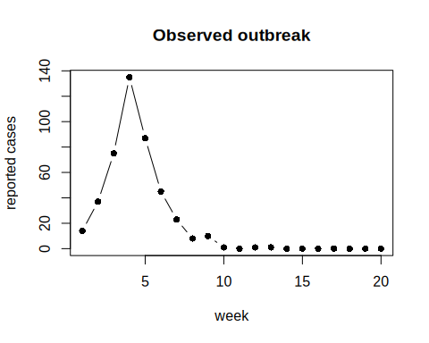
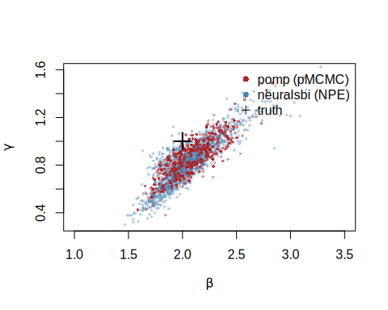
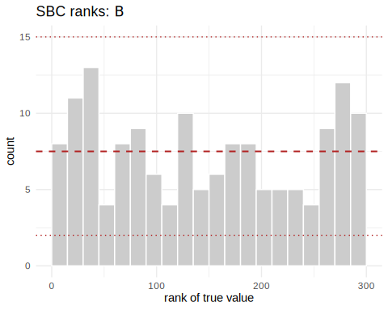

[`pomp`](https://kingaa.github.io/pomp/) is the established R toolkit for partially observed Markov process models, the stochastic dynamical systems that show up all over epidemiology and ecology. It fits them by particle filtering: a sequential Monte Carlo scheme that only ever simulates the latent state process, so you never write down its transition density. That makes `pomp` simulation-based in the same spirit as `neuralsbi`. The two packages differ in what they do next, and here we put them on the same problem to see whether their posteriors agree.

The problem is a stochastic SIR epidemic. A population of size $N$ splits into Susceptible, Infected and Recovered. The contact rate $\beta$ drives new infections, and the recovery rate $\gamma$ drives recoveries. We infer $\beta$ and $\gamma$ from a single noisy incidence curve. Infections and recoveries are random events rather than a smooth ODE, so there is no tractable likelihood for the observed curve.

A note on notation: SBI writes the observed data as $x$, the role regression gives to $y$. Here $x$ is the reported-case time series.

## The model, written twice

Both packages need the same generative model. `pomp` wants it as C snippets and `neuralsbi` wants a plain R function. The dynamics are identical: an Euler step with binomial transitions, and reported cases drawn as a binomial thinning of the true weekly incidence.


``` r
library(pomp)

sir_step <- Csnippet("
  double dN_SI = rbinom(S, 1 - exp(-Beta * I / N * dt));  // new infections
  double dN_IR = rbinom(I, 1 - exp(-gamma * dt));         // new recoveries
  S -= dN_SI;
  I += dN_SI - dN_IR;
  R += dN_IR;
  H += dN_SI;                                             // accumulate incidence
")

sir_rinit <- Csnippet("S = N - I0; I = I0; R = 0; H = 0;")

# pomp needs BOTH the measurement simulator (rmeasure) and its DENSITY
# (dmeasure): the particle filter has to evaluate p(reports | H).
rmeas <- Csnippet("reports = rbinom(H, rho);")
dmeas <- Csnippet("lik = dbinom(reports, H, rho, give_log);")
```

Fixed settings, and the true rates that generate our observation:


``` r
N <- 1000; I0 <- 10; rho <- 0.5; Tobs <- 20
theta_true <- c(Beta = 2, gamma = 1)      # basic reproduction number R0 = 2
```

We assemble the `pomp` object and simulate one outbreak. That simulated curve is the data both methods condition on.


``` r
sir <- pomp(
  data       = data.frame(time = 1:Tobs, reports = NA),
  times      = "time", t0 = 0,
  rprocess   = euler(sir_step, delta.t = 1/10),
  rinit      = sir_rinit,
  rmeasure   = rmeas, dmeasure = dmeas,
  accumvars  = "H",
  statenames = c("S", "I", "R", "H"),
  paramnames = c("Beta", "gamma", "rho", "N", "I0")
)

pars  <- c(theta_true, rho = rho, N = N, I0 = I0)
x_obs <- as.numeric(obs(simulate(sir, params = pars, seed = 12345)))
sir@data <- matrix(x_obs, nrow = 1, dimnames = list("reports", NULL))

plot(1:Tobs, x_obs, type = "b", pch = 16,
     xlab = "week", ylab = "reported cases", main = "Observed outbreak")
```

<div class="figure">

<p class="caption">plot of chunk unnamed-chunk-4</p>
</div>

## Route 1: pomp and particle-filter MCMC

The particle filter estimates the likelihood at any parameter value by propagating a swarm of simulated state trajectories and weighting them by `dmeasure`.


``` r
logLik(pfilter(sir, params = pars, Np = 1000))   # unbiased log-likelihood estimate
#> [1] -39.34408
```

For a Bayesian posterior, `pmcmc` embeds that filter inside a Metropolis-Hastings sampler. We put uniform priors on the two rates, the same priors `neuralsbi` will use, and run a short adaptive chain.


``` r
sir_bayes <- pomp(sir,
  dprior = Csnippet("
    lik = dunif(Beta, 0.5, 5, 1) + dunif(gamma, 0.2, 3, 1);
    lik = give_log ? lik : exp(lik);"),
  paramnames = c("Beta", "gamma"))

set.seed(1)
chain <- pmcmc(sir_bayes, Nmcmc = 2000, Np = 500, params = pars,
               proposal = mvn_rw_adaptive(rw.sd = c(Beta = 0.1, gamma = 0.05),
                                          scale.start = 100, shape.start = 200))

post_pomp <- as.data.frame(traces(chain))[501:2000, c("Beta", "gamma")]  # drop burn-in
round(colMeans(post_pomp), 3)
#>  Beta gamma 
#> 2.075 0.852
round(apply(post_pomp, 2, sd), 3)
#>  Beta gamma 
#> 0.221 0.168
```

The chain concentrates around the true rates. This posterior belongs to this one outbreak: a different curve means running the sampler again.

## Route 2: neuralsbi and neural posterior estimation

`neuralsbi` never evaluates a measurement density. It only needs to draw from the model, so we write the same dynamics as a simulator: one pair $(\beta, \gamma)$ in, one reported incidence curve of length 20 out. The prior names the two parameters after the simulator's arguments, so each one arrives by name.


``` r
library(neuralsbi)
#> 
#> Attaching package: 'neuralsbi'
#> The following object is masked from 'package:base':
#> 
#>     sample

sir_simulator <- function(Beta, gamma) {
  S <- N - I0; I <- I0; R <- 0
  out <- numeric(Tobs)
  for (tt in seq_len(Tobs)) {          # one entry per week
    H <- 0
    for (s in seq_len(10)) {           # ten Euler substeps, dt = 1/10
      dN_SI <- rbinom(1, S, 1 - exp(-Beta * I / N * 0.1))
      dN_IR <- rbinom(1, I, 1 - exp(-gamma * 0.1))
      S <- S - dN_SI; I <- I + dN_SI - dN_IR; R <- R + dN_IR; H <- H + dN_SI
    }
    out[tt] <- rbinom(1, H, rho)       # binomial reporting
  }
  out
}
```

Neural posterior estimation trains a conditional density estimator $q_\phi(\theta | x)$ on simulated $(\theta, x)$ pairs, then conditions it on the observed curve. Training is amortized: one fit works for any incidence curve, not just this one. A mixture density network suits this smooth, single-mode posterior.


``` r
prior <- prior_uniform(low  = c(Beta = 0.5, gamma = 0.2),   # same as pomp's dprior
                       high = c(Beta = 5,   gamma = 3))

# 8000 simulations to train a 2-parameter posterior. If it comes out too wide,
# add simulations before enlarging the network.
fit <- npe(prior, sir_simulator, n_simulations = 8000,
           density_estimator = "mdn", max_epochs = 400,
           n_restarts = 2, seed = 1)

post_npe <- posterior(fit, x_obs = x_obs)
draws_npe <- sample(post_npe, 4000)
round(colMeans(draws_npe), 3)
#>  Beta gamma 
#> 2.059 0.832
round(apply(draws_npe, 2, sd), 3)
#>  Beta gamma 
#> 0.257 0.202
```

Both posterior means land within 0.02 of `pomp`'s, and the standard deviations come out 15 to 20% larger.

## Do the posteriors agree?

We overlay the two posterior clouds and score them with a classifier two-sample test. An accuracy near 0.5 means a classifier cannot tell the two sets of draws apart.


``` r
# thin the NPE draws to pomp's count so neither cloud simply outnumbers the other
npe_thin <- draws_npe[sample(nrow(draws_npe), nrow(post_pomp)), ]
plot(npe_thin[, 1], npe_thin[, 2], pch = 16, cex = 0.5,
     col = adjustcolor("steelblue", 0.35),
     xlab = expression(beta), ylab = expression(gamma),
     xlim = c(1, 3.5), ylim = c(0.3, 1.6))
points(post_pomp$Beta, post_pomp$gamma, pch = 16, cex = 0.5,
       col = adjustcolor("firebrick", 0.4))
points(2, 1, pch = 3, cex = 2, lwd = 2)
legend("topright", c("pomp (pMCMC)", "neuralsbi (NPE)", "truth"),
       col = c("firebrick", "steelblue", "black"), pch = c(16, 16, 3), bty = "n")
```

<div class="figure">

<p class="caption">plot of chunk unnamed-chunk-9</p>
</div>

``` r

c2st(as.matrix(draws_npe), as.matrix(post_pomp), seed = 1)$accuracy
#> [1] 0.7270909
```

Both clouds lie along the same $\beta$ and $\gamma$ ridge. The two rates trade off because the data mostly pin down their ratio $R_0 = \beta/\gamma$, the same ridge the package README runs into on a different SIR model.

At 0.73 the C2ST is well above 0.5, and the plot shows why: the `neuralsbi` cloud is a little broader. `pomp`'s particle filter uses the known binomial measurement density to extract the sharpest posterior this data set supports. NPE gets only simulations, and at an 8000-simulation budget it stays slightly more cautious. More simulations tighten it toward `pomp`.

Is that extra width honest or a bug? Simulation-based calibration answers that without a reference posterior. Draw $\theta$ from the prior, simulate, and rank the truth among the posterior draws. Calibrated posteriors give uniform ranks.


``` r
sbc_res <- sbc(fit, sir_simulator, n_sbc = 150, n_posterior_samples = 300,
               seed = 2)
sbc_res                    # large p-values = calibrated
#> <nsbi_sbc> 150 trials, 300 posterior samples each
#>   per-parameter uniformity p-values (large = calibrated):
#>     Beta=0.419  gamma=0.223
plot_sbc(sbc_res, param = 1)
```

<div class="figure">

<p class="caption">plot of chunk unnamed-chunk-10</p>
</div>

The ranks are flat and the p-values are large, so NPE's wider intervals are calibrated rather than broken. The two packages give the same answer here, and NPE reports a touch more uncertainty for the simulations it was given.

## Similarities and differences

|  | `pomp` (pMCMC) | `neuralsbi` (NPE) |
|---|---|---|
| Latent state process | simulated only | simulated only |
| Measurement model | needs the density (`dmeasure`) | needs only to simulate |
| Inference | particle filter + MCMC | train a neural density estimator |
| Reusable across data sets | no, refit per observation | yes, amortized |
| Cost structure | cheap setup, rerun per data set | expensive training, then instant |
| Exactness | exact in the MCMC limit | approximate, so check the calibration |

Use `pomp` when you can write the measurement density and have one or a few data sets to fit. It will give you the sharpest and best understood posterior. Use `neuralsbi` when the measurement model itself is a black box, or when you need to condition on many data sets and amortization pays for the training up front. On this problem the two agree, which is the reassuring outcome: two different simulation-based machines, pointed at the same stochastic model, recover the same rates.

## See also

For the `neuralsbi` workflow in more depth, see `vignette("neuralsbi")` and `vignette("diagnostics")`. For `pomp`, see the [package tutorials](https://kingaa.github.io/pomp/docs.html).
