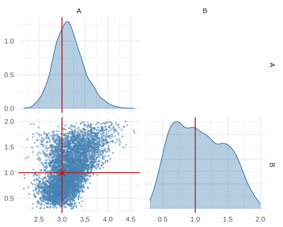
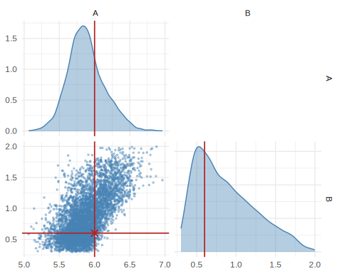
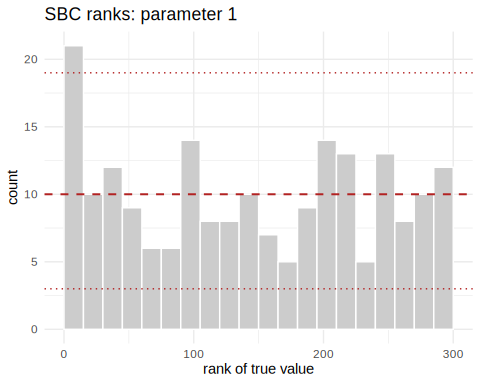
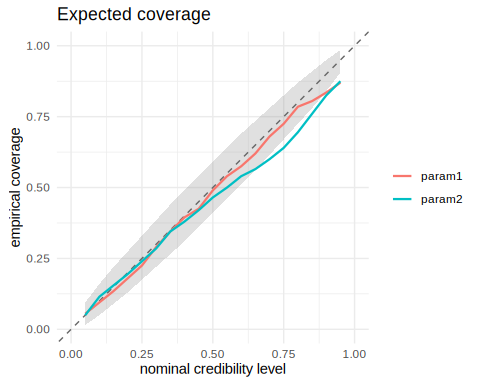
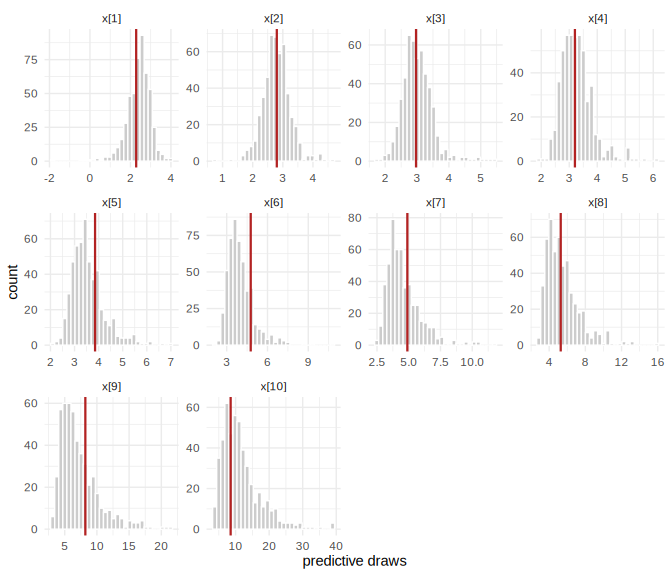

This is the first in a short series of tutorials on neural simulation-based inference (SBI) in R. It covers the basics: what problem SBI solves, the three ingredients every analysis needs, and what it means for a fit to be *amortized*. If you would rather see SBI recover a posterior you can verify by hand first, start with `vignette("neuralsbi")`, which runs the same workflow on a linear-Gaussian model with a closed-form answer. Later tutorials go deeper on density estimators, calibration, and applied case studies; this one stays small on purpose.

## The problem

Ordinary Bayesian inference needs a likelihood, $p(\mathbf{x} \mid \boldsymbol{\theta})$: a formula for how likely the data are, given the parameters. A simulator is code that generates synthetic data by drawing random numbers internally. It can sample from that data-generating process without effort; it just cannot evaluate the probability of any particular output, because doing so would mean integrating over every random draw the simulator makes internally. SBI replaces likelihood *evaluation* with simulation. Several methods do this in different ways; the one this package implements, neural posterior estimation, learns $p(\boldsymbol{\theta} \mid \mathbf{x})$ directly from (parameter, simulated-data) pairs.

A concrete example. The **g-and-k distribution** is a flexible model for skewed, heavy-tailed data such as rainfall totals, incomes, and financial returns, defined not by a density but by its quantile function:

$$Q(r) = A + B\left(1 + c\,\tanh\!\left(\frac{g z}{2}\right)\right)\left(1 + z^{2}\right)^{k} z,
\qquad z = \Phi^{-1}(r), \qquad c = 0.8.$$

Here $r \in (0,1)$ and $\Phi^{-1}$ is the standard normal quantile function.
Because this is an inverse-CDF construction, simulating is simply a matter of
drawing $z$ from a standard normal and evaluating the expression, which is
what `rgk()` below does. $A$ and $B$ are location and scale; $g$ and $k$
control skewness and tail weight; $c$ is a fixed asymmetry constant
conventionally set to 0.8.

But writing down the density means inverting $Q$, which has no closed form. The density can be recovered numerically, one root-find per observation, which is how `gk::dgk()` works and how Rayner and MacGillivray (2002) computed maximum likelihood estimates. That is exactly the position SBI is built for: a likelihood that is either impossible or impractical to evaluate, paired with a simulator that is trivial. It also makes the g-and-k a useful teaching case, because a likelihood-based answer exists to check against if you want one.

We will treat $g$ and $k$ as known (2 and 0.5) and infer the location $A$ and
scale $B$ from a small sample of observations.

## The three ingredients

Every SBI problem needs a **prior**, a **simulator**, and an **observation**.


``` r
library(neuralsbi)   # note: masks base::sample(); see below
#> 
#> Attaching package: 'neuralsbi'
#> The following object is masked from 'package:base':
#> 
#>     sample
set.seed(2024)

# (1) prior over the two parameters we want to infer. B is a scale parameter
# and must be positive; 0.3 to 2 brackets the plausible range for this
# example. A is location, so it gets a wide box.
prior <- prior_uniform(low = c(0, 0.3), high = c(10, 2))

# (2) simulator: an (n x 2) matrix of parameters -> an (n x 10) matrix of
# data. Each row draws 10 i.i.d. observations from the g-and-k distribution
# at that row's (A, B), with g = 2 and k = 0.5 fixed, then sorts them (see
# below for why).
rgk <- function(n, A, B, g = 2, k = 0.5, c_asym = 0.8) {
  z <- rnorm(n)
  A + B * (1 + c_asym * tanh(g * z / 2)) * (1 + z^2)^k * z
}
simulator <- function(theta) {
  t(apply(theta, 1, function(th) sort(rgk(10, th[1], th[2]))))
}
stopifnot(nrow(simulator(sample_prior(prior, 5))) == 5)

# (3) the observation: 10 draws from the g-and-k distribution with A = 3, B = 1
theta_true <- c(A = 3, B = 1)
x_obs <- simulator(rbind(theta_true))
```

The `sort()` matters more than it looks. The ten draws are exchangeable, so their ordering carries no information about $\boldsymbol{\theta}$, but the density estimator does not know that and would otherwise spend part of its budget learning it. Sorting imposes the symmetry for free: for an i.i.d. sample the order statistics are sufficient, so nothing is lost. The general rule is to impose the symmetries you know and learn only the features you do not.

Note what we are *not* doing: reducing the sample to summary statistics. ABC needed those, because it compared simulated and observed data through a distance threshold that fails in high dimensions. NPE conditions on the data directly and learns which features matter. Insufficient summaries are also invisible: a posterior conditioned on them stays perfectly calibrated, and simply comes out wider than it needed to be, so SBC will not warn you.

`neuralsbi` masks `base::sample()` with an S3 generic so that `sample(post, n)` can dispatch on a fitted posterior; `sample(1:10, 3)` still works as usual, and `sample_posterior()` is a non-generic alias if the masking gets in the way in a script.

One more thing worth flagging up front, especially if you come from regression or econometrics: SBI writes the *observed data* as $\mathbf{x}$, the role your outcome variable $y$ usually plays; covariates, if you have any, are absorbed into the simulator. The package README shows this collision directly: its regression example has a covariate `x` living inside the simulator, a response `y_obs`, and then passes `y_obs` to the argument `x_obs`. Expect to translate for a while: SBI's $\mathbf{x}$ is what a regression course calls the response. (Talts et al. and the Stan literature generally write the data as $y$, so following those citations you will meet both conventions.)

## Training an amortized posterior estimator

`npe()` (Neural Posterior Estimation) draws parameters from the prior, runs the simulator, and trains a **density estimator** $q_\phi(\boldsymbol{\theta} \mid \mathbf{x})$, a flexible conditional density with neural weights $\phi$, to approximate the posterior. Here $q_\phi$ is a **masked autoregressive flow** (Papamakarios et al., 2017): a standard normal pushed through a sequence of invertible transformations until it has the required shape, which is what lets the estimator both sample and evaluate its own density. It is the package default. No likelihood function appears anywhere in this call.


``` r
# 5000 simulations for a 2-parameter posterior. If the fit below looks too wide or the calibration check is off, add simulations before reaching for a bigger network.
fit <- npe(prior, simulator, n_simulations = 5000, seed = 1)
fit
#> <nsbi_npe> Neural Posterior Estimation fit
#>   density estimator : maf
#>   parameters (dim)  : 2
#>   data (dim)        : 10
#>   simulations       : 5000
#>   best val loss     : -0.4382
#>   -> build a posterior with posterior(fit, x_obs = ...)
```

`best val loss` above is the average negative log density, $-\log q_\phi(\boldsymbol{\theta} \mid \mathbf{x})$, on held-out simulations. It is useful for comparing fits on the same problem and means nothing compared across problems.

This fit is **amortized**: trained once, over the whole prior, it can be conditioned afterwards on any observation the prior predictive distribution could plausibly have produced, with no re-simulating and no retraining. That is the central practical payoff of NPE over likelihood-based MCMC, which restarts from scratch for every new data set. The caveat matters: an observation unlike anything in training still returns posterior draws, and they are not to be trusted. That is one of the things a posterior predictive check catches, which is why one appears below.

## Conditioning on the observation


``` r
post   <- posterior(fit, x_obs = x_obs)
draws  <- sample(post, 5000)
colnames(draws) <- c("A", "B")

summary(draws)
#>   parameter     mean        sd      q2.5      q25      q50      q75    q97.5
#> 1         A 3.547952 0.3502057 2.9275815 3.297965 3.529138 3.781315 4.263523
#> 2         B 1.413960 0.3090027 0.7708583 1.203194 1.446074 1.650534 1.921025
pairplot(draws, truth = theta_true)
```

<div class="figure">

<p class="caption">plot of chunk unnamed-chunk-4</p>
</div>

The posterior concentrates around $A = 3$, $B = 1$, the values that generated `x_obs`. How much to trust that width is the subject of the calibration check below.

## What amortization buys you

Condition the *same* fit on a second, unrelated observation. There is no simulation and no training here: just a forward pass through the network already trained above.


``` r
theta_true2 <- c(A = 6, B = 0.6)
x_obs2      <- simulator(rbind(theta_true2))

draws2 <- sample(posterior(fit, x_obs = x_obs2), 5000)
colnames(draws2) <- c("A", "B")
pairplot(draws2, truth = theta_true2)
```

<div class="figure">

<p class="caption">plot of chunk unnamed-chunk-5</p>
</div>

Reusing `fit` here is the point: an MCMC sampler would need to re-run its chains for `x_obs2`; the amortized posterior just evaluates the trained estimator at the new $\mathbf{x}$.

## Checking the fit

A trained estimator always returns *something*: samples, a mean, credible intervals, whether or not the fit is any good. Checking calibration is part of the workflow, not an optional extra. **Simulation-based calibration (SBC)** does this without needing a reference posterior to compare against. Draw $\boldsymbol{\theta}$ from the prior, simulate $\mathbf{x}$ from it, and record where that known $\boldsymbol{\theta}$ ranks among posterior draws conditioned on $\mathbf{x}$. A calibrated posterior puts the truth anywhere in that ranking with equal probability, so the ranks come out uniform.


``` r
res <- sbc(fit, simulator, n_sbc = 200, n_posterior_samples = 300, seed = 2)
res                # per-parameter uniformity p-values (large = calibrated)
#> <nsbi_sbc> 200 trials, 300 posterior samples each
#>   per-parameter uniformity p-values (large = calibrated):
#>     0.076  0.119

plot_sbc(res, param = 1)   # rank histogram for A: flat = calibrated
```

<div class="figure">

<p class="caption">plot of chunk unnamed-chunk-6</p>
</div>

``` r
plot_coverage(res)         # empirical vs. nominal credible-interval coverage
```

<div class="figure">

<p class="caption">plot of chunk unnamed-chunk-6</p>
</div>

``` r
expected_coverage(res)     # the numbers behind that plot
#>    nominal param1 param2
#> 1     0.05  0.025  0.060
#> 2     0.10  0.085  0.100
#> 3     0.15  0.120  0.135
#> 4     0.20  0.150  0.160
#> 5     0.25  0.185  0.195
#> 6     0.30  0.235  0.250
#> 7     0.35  0.300  0.280
#> 8     0.40  0.375  0.330
#> 9     0.45  0.430  0.390
#> 10    0.50  0.465  0.420
#> 11    0.55  0.495  0.455
#> 12    0.60  0.530  0.500
#> 13    0.65  0.585  0.555
#> 14    0.70  0.635  0.620
#> 15    0.75  0.685  0.690
#> 16    0.80  0.730  0.710
#> 17    0.85  0.790  0.750
#> 18    0.90  0.835  0.835
#> 19    0.95  0.910  0.880
```

$A$'s p-value is 0.076, just above the conventional 0.05 cutoff; $B$'s is 0.119, comfortably above it. Neither is a clean pass, and neither is a clear failure. Both coverage curves sit modestly below the diagonal through the middle of the range: a nominal 65% interval covers about 58% of the time for $A$ and 56% for $B$, the signature of mild overconfidence in both parameters. That is a realistic outcome for a first pass at ten draws per data set; the standard remedy is more simulations before reaching for a bigger network. `vignette("diagnostics")` covers the full set of checks, including what to do when a fit does not pass one.

## Posterior predictive check

The checks so far never look at `x_obs` itself. A **posterior predictive check** does: push posterior draws back through the simulator and compare the simulated data against the observation that produced the fit.


``` r
pred <- posterior_predictive(post, simulator, n = 500)
plot_posterior_predictive(pred, x_obs)
```

<div class="figure">

<p class="caption">plot of chunk unnamed-chunk-7</p>
</div>

This one cannot fail interestingly: `x_obs` came from the simulator itself, so it is guaranteed to look typical of the posterior predictive distribution. With real data it can fail, and that is when it earns its place, flagging a model that does not describe the data no matter how the parameters are set, which SBC cannot detect on its own.

## Where to go next

This tutorial deliberately skipped almost everything else:

- `vignette("neuralsbi")` walks the same workflow again with a linear-Gaussian model, where you can check the estimated posterior against an exact analytic answer.
- `vignette("density-estimators")` compares the mixture-density-network, flow, and closed-form estimators, and when each is worth using.
- `vignette("diagnostics")` covers the complete diagnostic toolkit: SBC, expected coverage, TARP, and posterior predictive checks.
- `vignette("sir-epidemic")` is a full applied case study, including sequential inference when simulations are expensive and only one observation matters.

For the ideas behind the method: Cranmer, Brehmer & Louppe (2020), ["The frontier of simulation-based inference"](https://www.pnas.org/doi/10.1073/pnas.1912789117), is a short, readable review. Papamakarios & Murray (2016), ["Fast &epsilon;-free inference of simulation models with Bayesian conditional density estimation"](https://arxiv.org/abs/1605.06376), introduced the approach NPE descends from. Talts et al. (2018), ["Validating Bayesian inference algorithms with simulation-based calibration"](https://arxiv.org/abs/1804.06788), is the reference for the SBC check used above. Lueckmann et al. (2021), ["Benchmarking simulation-based inference"](https://arxiv.org/abs/2101.04653), compares NPE against the other neural SBI algorithms this package does not implement (NLE, NRE). That is useful context for where `neuralsbi` sits in the broader landscape. Rayner & MacGillivray (2002) and Prangle (2020), via the latter's [`gk`](https://journal.r-project.org/articles/RJ-2020-010/) package, cover the g-and-k distribution itself.
