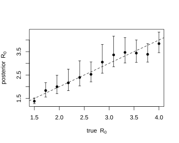
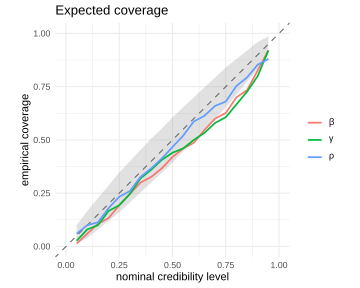

`vignette("neuralsbi")` shows the workflow: a prior, a simulator, `npe()`, a posterior. This article is about what that machinery is doing and why anyone would want it. We use the same stochastic SIR epidemic, so the code below will look familiar, and we spend the space on the ideas instead.

## The problem

Ordinary Bayesian inference needs a likelihood $p(x | \theta)$, a formula for how probable the data are at each parameter value. For the SIR model we cannot write one down.

The reason is the part of the model we never see. The simulator steps through 84 days, drawing new infections and new recoveries as binomial variables, and reports a thinned weekly total. To compute $p(x | \theta)$ for an observed case curve we would have to add up the probability of every unobserved epidemic path that could have produced it: every combination of daily infections and recoveries, over twelve weeks, consistent with the twelve numbers we saw. There are astronomically many, and no closed form for the sum.

Simulating, on the other hand, is easy. One call to the simulator gives one $(\theta, x)$ pair, and we can have as many as we are willing to wait for. Simulation-based inference is the family of methods that replaces likelihood evaluation with simulation. Neural posterior estimation, which is what `neuralsbi` implements, learns $p(\theta | x)$ directly from those pairs.

Other methods make other trades on the same problem. A particle filter estimates the likelihood by simulating the latent state forward, which works when you can write the *measurement* density even if the state process is a black box; `vignette("sir-epidemic")` runs `pomp` and `neuralsbi` side by side on one epidemic. Approximate Bayesian computation compares simulated to observed data through a distance threshold, which forces you to pick summary statistics. NPE conditions on the data as it comes and learns which features matter.

## What NPE learns

`npe()` trains a conditional density estimator $q_\phi(\theta | x)$, a flexible density over parameters with neural weights $\phi$, by maximizing $\sum_i \log q_\phi(\theta_i | x_i)$ over simulated pairs. The optimum of that objective is the posterior itself, so the trained network approximates $p(\theta | x)$ as well as its flexibility and the simulation budget allow.

The default $q_\phi$ is a masked autoregressive flow (Papamakarios et al., 2017): a standard normal pushed through a sequence of invertible transformations until it has the required shape. Invertible is what makes it useful here, because the same network can both draw samples and evaluate its own density. `vignette("density-estimators")` compares the alternatives.

Two consequences are worth stating plainly. First, the estimator is trained over the prior, so it works anywhere the prior predictive distribution puts mass, and nowhere else. Feed it an observation unlike anything it saw in training and it will still return draws, which are not to be trusted. Second, the fit does not depend on any particular observation, which is what "amortized" means, and which the rest of this article is about.

A note on notation, especially if you come from regression. SBI writes the observed data as $x$, the role your outcome variable $y$ usually plays. Covariates, if you have any, are arguments to the simulator. Expect to translate for a while.

## The model

The simulator and prior are the ones from `vignette("neuralsbi")`: a binomial SIR epidemic run day by day for twelve weeks, of which we observe a fraction $\rho$ of new infections as weekly case counts, on the $\log(1 + \text{cases})$ scale.


``` r
library(neuralsbi)   # note: masks base::sample(); see below
#> 
#> Attaching package: 'neuralsbi'
#> The following object is masked from 'package:base':
#> 
#>     sample

sir_simulator <- function(beta, gamma, rho, N = 1e5, I0 = 20, weeks = 12) {
  S <- N - I0; I <- I0
  reported <- numeric(weeks)
  for (w in seq_len(weeks)) {
    infections <- 0
    for (d in seq_len(7)) {
      new_inf <- rbinom(1, S, 1 - exp(-beta * I / N))
      new_rec <- rbinom(1, I, 1 - exp(-gamma))
      S <- S - new_inf
      I <- I + new_inf - new_rec
      infections <- infections + new_inf
    }
    reported[w] <- rbinom(1, infections, rho)
  }
  log1p(reported)
}

prior <- prior_uniform(low  = c(beta = 0.20, gamma = 0.08, rho = 0.1),
                       high = c(beta = 0.60, gamma = 0.20, rho = 0.9))

fit <- npe(prior, sir_simulator, n_simulations = 8000, seed = 1)
fit
#> <nsbi_npe> Neural Posterior Estimation fit
#>   density estimator : maf
#>   parameters (dim)  : 3
#>     names           : beta, gamma, rho 
#>   data (dim)        : 12
#>   simulations       : 8000
#>   best val loss     : -3.3695
#>   -> build a posterior with posterior(fit, x_obs = ...)
```

`neuralsbi` masks `base::sample()` with an S3 generic, so that `sample(post, n)` can dispatch on a fitted posterior. `sample(1:10, 3)` still works as usual, and `sample_posterior()` is a non-generic alias if the masking gets in the way in a script.

## What amortization buys you

Twelve outbreaks, each with a different $R_0$, each conditioned on the fit we already have. There is no simulation and no training in the loop below, only a forward pass per outbreak.


``` r
set.seed(7)
gamma_true <- 1 / 7
R0_grid <- seq(1.5, 4, length.out = 12)

summary_for <- function(R0) {
  x <- sir_simulator(R0 * gamma_true, gamma_true, rho = 0.5)
  d <- sample(posterior(fit, x_obs = x), 2000)
  r0 <- d[, "beta"] / d[, "gamma"]
  c(truth = R0, median = median(r0), quantile(r0, c(0.05, 0.95)))
}

res <- t(sapply(R0_grid, summary_for))
round(res, 2)
#>       truth median   5%  95%
#>  [1,]  1.50   1.38 1.27 1.52
#>  [2,]  1.73   1.84 1.56 2.17
#>  [3,]  1.95   2.00 1.70 2.50
#>  [4,]  2.18   2.17 1.83 2.75
#>  [5,]  2.41   2.40 2.04 3.10
#>  [6,]  2.64   2.53 2.21 3.06
#>  [7,]  2.86   3.05 2.58 3.81
#>  [8,]  3.09   3.36 2.85 4.16
#>  [9,]  3.32   3.47 3.02 4.10
#> [10,]  3.55   3.44 3.04 4.00
#> [11,]  3.77   3.39 3.05 3.84
#> [12,]  4.00   3.84 3.46 4.33

plot(res[, "truth"], res[, "median"], pch = 16, ylim = range(res[, 3:4]),
     xlab = expression(true ~ R[0]), ylab = expression(posterior ~ R[0]))
arrows(res[, "truth"], res[, "5%"], res[, "truth"], res[, "95%"],
       code = 3, angle = 90, length = 0.03)
abline(0, 1, lty = 2)
```

<div class="figure">

<p class="caption">plot of chunk amortized</p>
</div>

All twelve intervals cover the $R_0$ that generated their outbreak, and every one of those posteriors came from the same network. A likelihood-based sampler would have run twelve times; here the cost of the thirteenth outbreak, and the thousandth, is another forward pass. That is the trade neural posterior estimation makes: pay the simulation and training cost once, up front, and then condition on data for free. It pays off whenever you have many data sets to fit, or new data arriving, and it does not pay off when you have one observation and a cheap likelihood.

The intervals also stay inside the prior, which is why the grid stops at $R_0 = 4$. At $\gamma = 1/7$ that is a contact rate of 0.57, near the top of the prior's range for $\beta$. Push the truth past the prior and the posterior has nowhere to go.

## What the data can and cannot tell you

The pairplot in `vignette("neuralsbi")` shows $\beta$ and $\gamma$ lying along a ridge rather than in a blob. That is a statement about the data, not about the estimator. An epidemic curve is shaped mostly by $R_0 = \beta/\gamma$, so many pairs of rates fit it about equally well, and the posterior says so by spreading along the ridge.

Derived quantities come out of the posterior draws directly, and the contrast is easy to see in the relative widths:


``` r
x_obs <- sir_simulator(2 * gamma_true, gamma_true, rho = 0.6)
draws <- sample(posterior(fit, x_obs = x_obs), 4000)

R0 <- draws[, "beta"] / draws[, "gamma"]
round(c(beta = sd(draws[, "beta"]) / mean(draws[, "beta"]),
        gamma = sd(draws[, "gamma"]) / mean(draws[, "gamma"]),
        R0 = sd(R0) / mean(R0)), 3)
#>  beta gamma    R0 
#> 0.080 0.190 0.118

round(quantile(R0, c(0.05, 0.5, 0.95)), 2)
#>   5%  50%  95% 
#> 1.79 2.10 2.61
```

Twelve weekly counts pin $\beta$ down to about 8% of its own mean and leave $\gamma$ at 19%. $R_0$, built from both, lands in between at 12%, tighter than the recovery rate it divides by. The epidemic's growth constrains the combination better than it constrains $\gamma$ on its own, and no amount of training changes that: it is what the data carry. In a real application this is where external information belongs. Fix the recovery rate from what is known about the disease, or put a tight prior on it, and $R_0$ tightens with it.

## Trusting the answer

A trained estimator always returns something, so checking is part of the workflow. Simulation-based calibration is the first check: draw $\theta$ from the prior, simulate $x$, and rank the true $\theta$ among posterior draws given $x$. Calibrated posteriors give uniform ranks and coverage on the diagonal.


``` r
res_sbc <- sbc(fit, sir_simulator, n_sbc = 150, n_posterior_samples = 300,
               seed = 2)
res_sbc
#> <nsbi_sbc> 150 trials, 300 posterior samples each
#>   per-parameter uniformity p-values (large = calibrated):
#>     beta=0.312  gamma=0.040  rho=0.086
plot_coverage(res_sbc)
```

<div class="figure">

<p class="caption">plot of chunk sbc</p>
</div>

$\beta$ passes comfortably at 0.31. $\gamma$ (0.040) and $\rho$ (0.086) are borderline, and the coverage curve sits a little under the diagonal, so the intervals are mildly too narrow. Nothing here says the fit is broken; it says quote $\gamma$'s interval with care and add simulations if you need it sharper.

SBC averages over the prior and never looks at the observation you actually have. A posterior predictive check does, and it is the one that catches a simulator that cannot reproduce your data at any parameter value. `vignette("diagnostics")` covers both, along with TARP and the classifier two-sample test, and says what to do when a fit does not pass.

## Where to go next

- `vignette("neuralsbi")` is the short workflow tour on this same model.
- `vignette("density-estimators")` compares the mixture-density-network, flow and closed-form estimators.
- `vignette("diagnostics")` is the complete diagnostic toolkit.
- `vignette("sir-epidemic")` puts NPE next to `pomp`'s particle-filter MCMC on one epidemic, and `vignette("sir-time-varying-beta")` scales the idea to three competing models across all 50 US states.

For the ideas behind the method, Cranmer, Brehmer and Louppe (2020), ["The frontier of simulation-based inference"](https://doi.org/10.1073/pnas.1912789117), is a short and readable review. Papamakarios and Murray (2016), ["Fast &epsilon;-free inference of simulation models with Bayesian conditional density estimation"](https://doi.org/10.48550/arXiv.1605.06376), introduced the approach NPE descends from. Talts et al. (2018), ["Validating Bayesian inference algorithms with simulation-based calibration"](https://doi.org/10.48550/arXiv.1804.06788), is the reference for the calibration check used above. Lueckmann et al. (2021), ["Benchmarking simulation-based inference"](https://doi.org/10.48550/arXiv.2101.04653), compares NPE against the other neural SBI algorithms, which is useful context for where `neuralsbi` sits.
