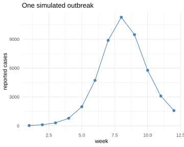
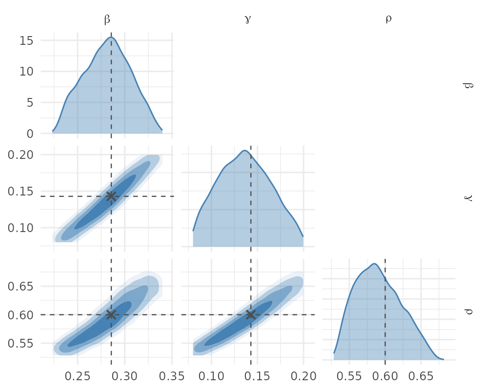
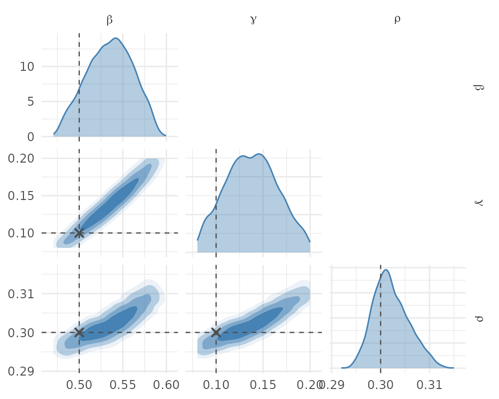

This tutorial provides a short introduction to neural simulation-based inference (SBI) in R using the `neuralsbi` R package. Here we will focus on one of three key sets of methods in neural SBI: neural posterior estimation (NPE). The goal in NPE is to approximate the posterior distribution $p(\theta | x )$ of parameters of interest $\theta$. Here we will use the example of stochastic SIR model.

# Inputs to neural posterior estimation: A simulator and a prior distribution

`neuralsbi` requires two inputs: a prior over the parameters you want to estimate, and a simulator that maps one parameter vector set into one vector of outcomes. The simulator can (and normally should) be stochastic, so the same parameter vector $\theta$ can result in many possible realizations. Variation in observed outcomes can come from both the underlying process (i.e., disease spreads stochastically) and measurement (i.e., we don't observe all cases).

## Define your simulator

Here we write a "chain binomial" SIR model in daily time-steps, with a population of size $N$. The parameters we want to estimate are the transmission rate $\beta$, the recovery rate $\gamma$, and the reporting fraction $\rho$: we only see a fraction $\rho$ of the new infections as reported cases. The simulator returns one number per day, the reported cases, over 12 weeks. In reality, we would want to inform $\gamma$ using external information, which we can do by providing an informative prior for $\gamma$.


``` r
library(neuralsbi)
#> 
#> Attaching package: 'neuralsbi'
#> The following object is masked from 'package:base':
#> 
#>     sample
library(future)

sir_simulator <- function(beta, gamma, rho, N = 1e5, I0 = 20, days = 84) {
  S <- N - I0; I <- I0
  reported <- numeric(days)
  for (d in seq_len(days)) {
    new_inf <- rbinom(1, S, 1 - exp(-beta * I / N))
    new_rec <- rbinom(1, I, 1 - exp(-gamma))
    S <- S - new_inf
    I <- I + new_inf - new_rec
    reported[d] <- rbinom(1, new_inf, rho)              # only rho of them are seen
  }
  reported
}

# Define our priors:
prior <- prior_uniform(low  = c(beta = 0.20, gamma = 0.08, rho = 0.1),
                       high = c(beta = 0.60, gamma = 0.20, rho = 0.7))
```

It is always a good idea to test our simulator, so here we simulate one outbreak:


``` r
theta_true <- c(beta = 2 / 7, gamma = 1 / 7, rho = 0.6)   # R0 = 2, 7-day recovery

set.seed(1)
x_obs <- sir_simulator(theta_true[["beta"]], theta_true[["gamma"]],
                       theta_true[["rho"]])

ggplot2::ggplot(data.frame(day = seq_along(x_obs), cases = x_obs),
                ggplot2::aes(x = day, y = cases)) +
  ggplot2::geom_line(colour = "steelblue") +
  ggplot2::labs(x = "day", y = "reported cases", title = "One simulated outbreak") +
  ggplot2::theme_minimal()
```

<div class="figure">

<p class="caption">plot of chunk outbreak</p>
</div>

## Train your neural posterior estimator

Our simulator returns 84 numbers, one per day, and we only want three parameters back. Conditioning the density estimator on all 84 days directly would spend most of its capacity learning the shape of an epidemic curve rather than the posterior we asked for. So we hand `npe()` an embedding network: `embedding_mlp()` specifies a small multilayer perceptron that compresses the daily series into 12 features, and `npe()` trains it jointly with the flow. The estimator then conditions on those 12 learned summaries instead of the raw 84 days. `npe()` is the slow step in this tutorial: training the embedding and the flow together takes a few minutes on a laptop, and everything after it is fast.


``` r
plan(multisession) # to run the simulator in parallel
fit <- npe(prior, sir_simulator, n_simulations = 10000,
           embedding_net = embedding_mlp(output_dim = 12))
fit
#> <nsbi_npe> Neural Posterior Estimation fit
#>   density estimator : maf
#>   parameters (dim)  : 3
#>     names           : beta, gamma, rho 
#>   data (dim)        : 84
#>   embedding (mlp)   : 84 -> 12 features
#>   simulations       : 10000
#>   best val loss     : -3.1405
#>   -> build a posterior with posterior(fit, x_obs = ...)
```

`npe()` drew 10000 parameter sets from the prior, ran the simulator on each, and trained the embedding network and a masked autoregressive flow together on the resulting $(\theta, x)$ pairs.

## Condition on your data to get a posterior

`posterior()` conditions the trained estimator on an observation. This step is quick because it only evaluates the neural network at the observed `x` values, so it runs instantly, and our `sample()` methods draw samples from our posterior object.


``` r
post  <- posterior(fit, x_obs = x_obs)
draws <- sample(post, 4000)

round(colMeans(draws), 3)
#>  beta gamma   rho 
#> 0.281 0.136 0.591
pairplot(draws, truth = theta_true)
```

<div class="figure">

<p class="caption">plot of chunk posterior</p>
</div>

The posterior should cover the values that generated `x_obs`, and it does. It also shows the ridge between the parameters in the SIR model that should be familiar if you ever fitted those models: the posterior of $\beta$ and $\gamma$ are correlated because a single case time-series better identifies their ratio $R_0 = \beta/\gamma$ than either parameter alone. That is another reason to tighten up our prior on $\gamma$.

## *Amortized* Posterior Inference

In other estimation approaches, the computationally-expensive procedure that infers parameters based on observations is tightly coupled to the data, in the sense that the whole fitting process revolves around searching the parameter space for parameters that have high likelihood of resulting in *one data set*. With *amortized* inference, we have already *paid* the price of learning how our parameters relate to outcomes by training our neural posterior estimator over its whole prior distribution.

Once we have done this, all we need to do is to present it with some other data, and obtaining a posterior distribution is essentially computationally "free". For an SIR model, that means we can now fit our model to any set of data almost instantly. 

If that didn't make you spill your coffee, read this again. You can present *any* new data vector and fit your model again, instantly.

Let's try this. Now we present our model with an outbreak with an R0 = 5 that is poorly reported. Can we recover those parameters?

Note that the model doesn't see anything other than the data produced by the simulation:


``` r
theta_2 <- c(beta = 0.5, gamma = 0.1, rho = 0.3)          # R0 = 5, poorly reported
x_obs_2 <- sir_simulator(theta_2[["beta"]], theta_2[["gamma"]], theta_2[["rho"]])

draws_2 <- sample(posterior(fit, x_obs = x_obs_2), 4000)
round(colMeans(draws_2), 3)
#>  beta gamma   rho 
#> 0.535 0.138 0.302
pairplot(draws_2, truth = theta_2)
```

<div class="figure">

<p class="caption">plot of chunk second</p>
</div>

$\beta$ and $\rho$ come back close. $\gamma$ does not: the fit puts it around 0.14 against a true 0.100, which is the $\beta/\gamma$ ridge from the previous section showing up again. A single case series identifies the ratio $R_0 = \beta/\gamma$ better than either rate on its own, so $\gamma$ drifts toward the middle of its prior when the data do not pin it down. You can present as many data sets as you like this way and check what comes back.

Recovering the parameters that generated a couple of data sets is not the same as showing the posterior is calibrated. Before you quote intervals from a fit like this one, run the diagnostics: `sbc()` ranks the true parameter among posterior draws over many prior draws, `expected_coverage()` turns those ranks into coverage at each nominal credible level, and `posterior_predictive()` compares simulations from the posterior against the observation.
