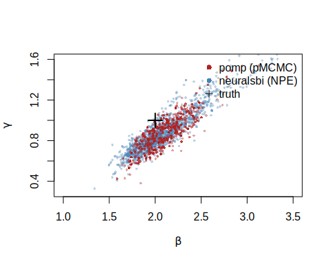
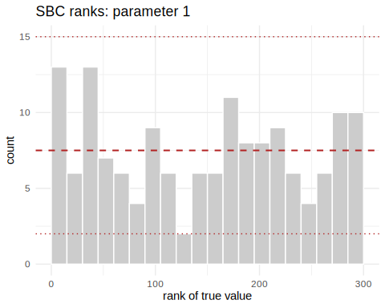

[`pomp`](https://kingaa.github.io/pomp/) is the established R toolkit for
partially observed Markov process models — the stochastic dynamical systems
common in epidemiology and ecology. It fits them by *particle filtering*: a
sequential Monte Carlo scheme that only ever *simulates* the latent state
process, so you never write down its transition density. That makes `pomp`
simulation-based in the same spirit as `neuralsbi`. The two packages differ in
what they do next, and this vignette puts them on the same problem to see
whether their posteriors agree.

The problem is a stochastic **SIR** epidemic. A population of size `N` splits
into Susceptible, Infected, and Recovered; the contact rate \(\beta\) drives
new infections and the recovery rate \(\gamma\) drives recoveries. We infer
\((\beta, \gamma)\) from a single noisy incidence curve. The dynamics are
genuinely stochastic — infections and recoveries are random events, not a
smooth ODE — so there is no tractable likelihood for the observed curve.

(A note on notation: SBI writes the observed data \(\mathbf{x}\), the role
regression gives to \(y\). Here \(\mathbf{x}\) is the reported-case time
series.)

## The model, written twice

Both packages need the same generative model. `pomp` wants it as C snippets;
`neuralsbi` wants a vectorized R function. The dynamics are identical: an
Euler step with binomial transitions, and reported cases drawn as a binomial
thinning of the true weekly incidence.


``` r
library(pomp)

sir_step <- Csnippet("
  double dN_SI = rbinom(S, 1 - exp(-Beta * I / N * dt));  // new infections
  double dN_IR = rbinom(I, 1 - exp(-gamma * dt));         // new recoveries
  S -= dN_SI;
  I += dN_SI - dN_IR;
  R += dN_IR;
  H += dN_SI;                                             // accumulate incidence
")

sir_rinit <- Csnippet("S = N - I0; I = I0; R = 0; H = 0;")

# pomp needs BOTH the measurement simulator (rmeasure) and its DENSITY
# (dmeasure): the particle filter has to evaluate p(reports | H).
rmeas <- Csnippet("reports = rbinom(H, rho);")
dmeas <- Csnippet("lik = dbinom(reports, H, rho, give_log);")
```

Fixed settings and the true rates that generate our observation:


``` r
N <- 1000; I0 <- 10; rho <- 0.5; Tobs <- 20
theta_true <- c(Beta = 2, gamma = 1)      # basic reproduction number R0 = 2
```

We assemble the `pomp` object and simulate one outbreak. That simulated curve
is the data both methods will condition on.


``` r
sir <- pomp(
  data       = data.frame(time = 1:Tobs, reports = NA),
  times      = "time", t0 = 0,
  rprocess   = euler(sir_step, delta.t = 1/10),
  rinit      = sir_rinit,
  rmeasure   = rmeas, dmeasure = dmeas,
  accumvars  = "H",
  statenames = c("S", "I", "R", "H"),
  paramnames = c("Beta", "gamma", "rho", "N", "I0")
)

pars  <- c(theta_true, rho = rho, N = N, I0 = I0)
x_obs <- as.numeric(obs(simulate(sir, params = pars, seed = 12345)))
sir@data <- matrix(x_obs, nrow = 1, dimnames = list("reports", NULL))

plot(1:Tobs, x_obs, type = "b", pch = 16,
     xlab = "week", ylab = "reported cases", main = "Observed outbreak")
```

<div class="figure">

<p class="caption">plot of chunk unnamed-chunk-4</p>
</div>

## Route 1 — pomp: particle-filter MCMC

The particle filter estimates the likelihood at any parameter value by
propagating a swarm of simulated state trajectories and weighting them by
`dmeasure`.


``` r
logLik(pfilter(sir, params = pars, Np = 1000))   # unbiased log-likelihood estimate
#> [1] -39.34408
```

For a Bayesian posterior, `pmcmc` embeds that filter inside a
Metropolis-Hastings sampler. We put uniform priors on the two rates — the same
priors `neuralsbi` will use — and run a short adaptive chain.


``` r
sir_bayes <- pomp(sir,
  dprior = Csnippet("
    lik = dunif(Beta, 0.5, 5, 1) + dunif(gamma, 0.2, 3, 1);
    lik = give_log ? lik : exp(lik);"),
  paramnames = c("Beta", "gamma"))

set.seed(1)
chain <- pmcmc(sir_bayes, Nmcmc = 2000, Np = 500, params = pars,
               proposal = mvn_rw_adaptive(rw.sd = c(Beta = 0.1, gamma = 0.05),
                                          scale.start = 100, shape.start = 200))

post_pomp <- as.data.frame(traces(chain))[501:2000, c("Beta", "gamma")]  # drop burn-in
round(colMeans(post_pomp), 3)
#>  Beta gamma 
#> 2.075 0.852
round(apply(post_pomp, 2, sd), 3)
#>  Beta gamma 
#> 0.221 0.168
```

The chain concentrates around the true rates. This posterior is specific to
this one outbreak: a different curve means running the sampler again.

## Route 2 — neuralsbi: neural posterior estimation

`neuralsbi` never evaluates a measurement density. It only needs to *draw* from
the model, so we write the same dynamics as a vectorized simulator: an
\(n \times 2\) matrix of parameters in, an \(n \times 20\) matrix of reported
curves out.


``` r
library(neuralsbi)
#> 
#> Attaching package: 'neuralsbi'
#> The following object is masked from 'package:base':
#> 
#>     sample

sir_simulator <- function(theta) {
  n <- nrow(theta); Beta <- theta[, 1]; gamma <- theta[, 2]
  S <- rep(N - I0, n); I <- rep(I0, n); R <- rep(0, n)
  out <- matrix(0, n, Tobs)
  for (tt in seq_len(Tobs)) {          # one column per week
    H <- rep(0, n)
    for (s in seq_len(10)) {           # ten Euler substeps, dt = 1/10
      dN_SI <- rbinom(n, S, 1 - exp(-Beta * I / N * 0.1))
      dN_IR <- rbinom(n, I, 1 - exp(-gamma * 0.1))
      S <- S - dN_SI; I <- I + dN_SI - dN_IR; R <- R + dN_IR; H <- H + dN_SI
    }
    out[, tt] <- rbinom(n, H, rho)     # binomial reporting
  }
  out
}
```

Neural Posterior Estimation (NPE) trains a conditional density estimator
\(q_\phi(\boldsymbol{\theta} \mid \mathbf{x})\) on simulated
\((\boldsymbol{\theta}, \mathbf{x})\) pairs, then conditions it on the observed
curve. Training is *amortized*: one fit works for any incidence curve, not just
this one. A mixture density network suits this smooth, unimodal posterior.


``` r
prior <- prior_uniform(low = c(0.5, 0.2), high = c(5, 3))   # same as pomp's dprior

# 8000 simulations to train a 2-parameter posterior. If it comes out too wide,
# add simulations before enlarging the network.
fit <- npe(prior, sir_simulator, n_simulations = 8000,
           density_estimator = "mdn", max_epochs = 400,
           n_restarts = 2, seed = 1)

post_npe <- posterior(fit, x_obs = x_obs)
draws_npe <- sample(post_npe, 4000)
round(colMeans(draws_npe), 3)
#> [1] 2.097 0.894
round(apply(draws_npe, 2, sd), 3)
#> [1] 0.347 0.239
```

## Do the posteriors agree?

Overlay the two posterior clouds and score them with a classifier two-sample
test (C2ST): an accuracy near 0.5 means a classifier cannot tell the two sets
of draws apart.


``` r
# thin the NPE draws to pomp's count so neither cloud simply outnumbers the other
npe_thin <- draws_npe[sample(nrow(draws_npe), nrow(post_pomp)), ]
plot(npe_thin[, 1], npe_thin[, 2], pch = 16, cex = 0.5,
     col = adjustcolor("steelblue", 0.35),
     xlab = expression(beta), ylab = expression(gamma),
     xlim = c(1, 3.5), ylim = c(0.3, 1.6))
points(post_pomp$Beta, post_pomp$gamma, pch = 16, cex = 0.5,
       col = adjustcolor("firebrick", 0.4))
points(2, 1, pch = 3, cex = 2, lwd = 2)
legend("topright", c("pomp (pMCMC)", "neuralsbi (NPE)", "truth"),
       col = c("firebrick", "steelblue", "black"), pch = c(16, 16, 3), bty = "n")
```

<div class="figure">

<p class="caption">plot of chunk unnamed-chunk-9</p>
</div>

``` r

c2st(as.matrix(draws_npe), as.matrix(post_pomp), seed = 1)$accuracy
#> [1] 0.7272727
```

The two posteriors sit on top of each other: same location, same
\(\beta\)–\(\gamma\) ridge (the two rates trade off because the data mostly pin
down their ratio \(R_0\)). The C2ST lands well above 0.5, and the plot shows
why — the `neuralsbi` cloud is a little broader. That is the expected
signature of the trade-off. `pomp`'s particle filter exploits the *known*
binomial measurement density to extract the sharpest posterior this dataset
supports; NPE is handed only simulations and, at an 8000-simulation budget,
stays slightly more cautious. More simulations tighten it toward `pomp`.

Is that extra width honest or a bug? Simulation-based calibration answers it
without a reference posterior: draw \(\boldsymbol{\theta}\) from the prior,
simulate, and rank the truth among the posterior draws. Calibrated posteriors
give uniform ranks.


``` r
sbc_res <- sbc(fit, sir_simulator, n_sbc = 150, n_posterior_samples = 300,
               seed = 2)
sbc_res                    # large p-values = calibrated
#> <nsbi_sbc> 150 trials, 300 posterior samples each
#>   per-parameter uniformity p-values (large = calibrated):
#>     0.312  0.181
plot_sbc(sbc_res, param = 1)
```

<div class="figure">

<p class="caption">plot of chunk unnamed-chunk-10</p>
</div>

The ranks are flat and the p-values large: NPE's wider intervals are
calibrated, not broken. `neuralsbi` and `pomp` give the same answer here, and
NPE simply reports a touch more uncertainty for the simulations it was given.

## Similarities and differences

|  | `pomp` (pMCMC) | `neuralsbi` (NPE) |
|---|---|---|
| Latent state process | simulated only | simulated only |
| Measurement model | needs the **density** (`dmeasure`) | needs only to **simulate** |
| Inference | particle filter + MCMC | train a neural density estimator |
| Reusable across datasets | no — refit per observation | yes — amortized |
| Cost structure | cheap setup, rerun per dataset | expensive training, then instant |
| Exactness | exact in the MCMC limit | approximate; **must** be calibration-checked |

Reach for `pomp` when you can write the measurement density and have one or a
few datasets to fit — it will give the sharpest, best-understood posterior.
Reach for `neuralsbi` when the measurement model itself is a black box, or when
you need to condition on many datasets and amortization pays for the training
up front. On this problem they agree, which is the reassuring outcome: two
different simulation-based machines, pointed at the same stochastic model,
recover the same rates.

For the `neuralsbi` workflow in more depth, see `vignette("neuralsbi")` and
`vignette("diagnostics")`; for `pomp`, the
[package tutorials](https://kingaa.github.io/pomp/docs.html).
