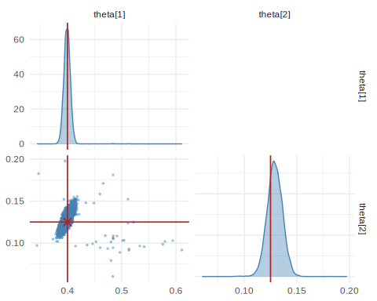
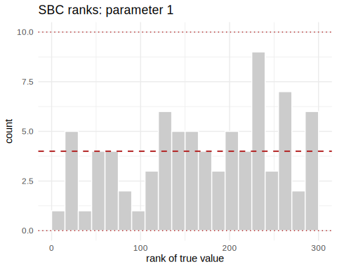
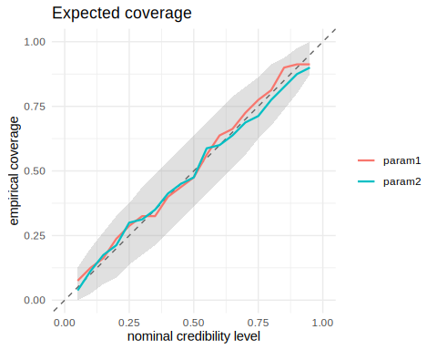
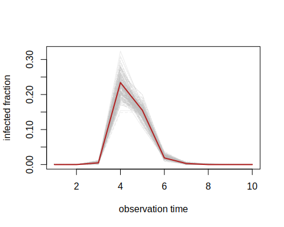
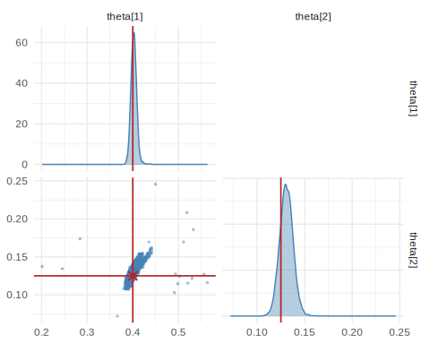

This vignette works an applied, likelihood-free problem end to end: recovering
the transmission and recovery rates of an epidemic from a noisy incidence
curve. There is no tractable likelihood — the data come from a stochastic
compartmental simulator — which is precisely the setting simulation-based
inference was developed for.

## The model

The classic **SIR** model splits a population of size `N` into Susceptible,
Infected, and Recovered compartments. Two rates govern the dynamics: the
contact rate \(\beta\) (how fast the infection spreads) and the recovery rate
\(\gamma\) (how fast infected individuals recover). The package includes this
model as a built-in task.


``` r
library(neuralsbi)

task <- task_sir()          # prior + simulator for the SIR model
task
#> <nsbi_task> sir: 2 parameters -> 10 data dims
```

The task bundles a `prior` (log-normal on \(\beta, \gamma\)) and a
`simulator` that solves the SIR dynamics and returns the observed infected
fraction at 10 time points.

## Fit an amortized posterior

We simulate from the prior and train a neural posterior estimator. A Mixture
Density Network is a good default here; the posterior is smooth and unimodal.


``` r
fit <- npe(task$prior, task$simulator,
           n_simulations = 3000,
           density_estimator = "mdn",
           max_epochs = 250, seed = 1)
```

Training is *amortized*: this one fit can be conditioned on any incidence curve
without re-simulating.

## Condition on an observation

Suppose we observe an outbreak generated by \(\beta = 0.4,\ \gamma = 0.125\)
(basic reproduction number \(R_0 = \beta/\gamma = 3.2\)).


``` r
theta_true <- c(beta = 0.4, gamma = 0.125)
x_obs <- task$simulator(matrix(theta_true, nrow = 1))

post <- posterior(fit, x_obs = x_obs)
summary(post, n = 5000)
#>   parameter      mean          sd      q2.5       q25       q50       q75
#> 1    theta1 0.3994986 0.008617038 0.3876099 0.3951481 0.3992741 0.4032756
#> 2    theta2 0.1291057 0.007482159 0.1145163 0.1242678 0.1292441 0.1340240
#>       q97.5
#> 1 0.4106381
#> 2 0.1433673

draws <- sample(post, 10000)
pairplot(draws, truth = theta_true)
```

<div class="figure">

<p class="caption">plot of chunk unnamed-chunk-4</p>
</div>

The posterior concentrates around the true rates, and — importantly — reports
its own uncertainty.

## Is the posterior calibrated?

A posterior is only trustworthy if it is *calibrated*. We check with
Simulation-Based Calibration and an expected-coverage plot, neither of which
needs a reference posterior.


``` r
res <- sbc(fit, task$simulator, n_sbc = 80, n_posterior_samples = 300,
           seed = 2)
#> Warning in stats::chisq.test(tab): Chi-squared approximation may be incorrect
#> Warning in stats::chisq.test(tab): Chi-squared approximation may be incorrect
res                     # per-parameter uniformity p-values (large = good)
#> <nsbi_sbc> 80 trials, 300 posterior samples each
#>   per-parameter uniformity p-values (large = calibrated):
#>     0.337  0.886

plot_sbc(res, param = 1)   # rank histogram: flat = calibrated
```

<div class="figure">

<p class="caption">plot of chunk unnamed-chunk-5</p>
</div>

``` r
plot_coverage(res)         # empirical vs nominal coverage: on the diagonal = good
```

<div class="figure">

<p class="caption">plot of chunk unnamed-chunk-5</p>
</div>

If the rank histograms are flat and the coverage curve hugs the diagonal, the
posterior's credible intervals mean what they say: a 90% interval contains the
truth about 90% of the time.

## Posterior predictive check

Finally, push posterior draws back through the simulator and compare the
predicted incidence curves to the observation.


``` r
pp <- posterior_predictive(post, task$simulator, n = 200)
matplot(t(pp), type = "l", col = adjustcolor("grey", 0.3),
        xlab = "observation time", ylab = "infected fraction")
lines(as.numeric(x_obs), col = "firebrick", lwd = 2)
```

<div class="figure">

<p class="caption">plot of chunk unnamed-chunk-6</p>
</div>

The observed curve should sit comfortably within the cloud of predictive draws.
A systematic mismatch would flag model misspecification — a signal no
point estimate can give you.

## Spending simulations where they matter: sequential NPE

An amortized fit spreads its simulation budget over the whole prior, but when
a single outbreak is of interest, most of those simulations describe
epidemics nothing like the observed one. Sequential NPE (`npe_sequential()`,
using truncated proposals) alternates simulation and training, restricting
each new round of simulations to the parameter region the current posterior
considers plausible.


``` r
fit_seq <- npe_sequential(task$prior, task$simulator, x_obs = x_obs,
                          n_rounds = 2, n_simulations = 1500,
                          density_estimator = "mdn", max_epochs = 200, seed = 3)
fit_seq                    # per-round budgets and acceptance rates
#> <nsbi_snpe> Sequential NPE fit (TSNPE, truncated-prior proposals)
#>   density estimator : mdn
#>   rounds            : 2
#>   simulations       : 3000
#>   acceptance/round  : 1.00, 0.65
#>   targeted x_obs    : 0, 0, 0.005, 0.234, 0.155, 0.019, 0.003, 0, 0, 0
#>   NOT amortized: only valid at (or near) the targeted x_obs.
#>   -> build a posterior with posterior(fit, x_obs = ...)

post_seq  <- posterior(fit_seq, x_obs = x_obs)
draws_seq <- sample(post_seq, 10000)
pairplot(draws_seq, truth = theta_true)
```

<div class="figure">

<p class="caption">plot of chunk unnamed-chunk-7</p>
</div>

With a comparable total simulation budget, the sequential fit typically yields
a tighter posterior around this particular outbreak. The trade-off: the result
is specific to `x_obs`, so conditioning on a different incidence curve means
refitting.

## Where to go next

This case study covered the whole workflow: prior, simulator, amortized
training, conditioning, calibration checks, predictive checks, and a
sequential refinement. The earlier vignettes treat each stage in more depth —
`vignette("neuralsbi")` for the core functions,
`vignette("density-estimators")` for when to use `"maf"` or `"nsf"` instead
of the MDN, and `vignette("diagnostics")` for the complete set of checks.
