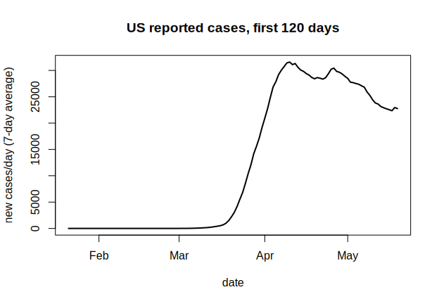
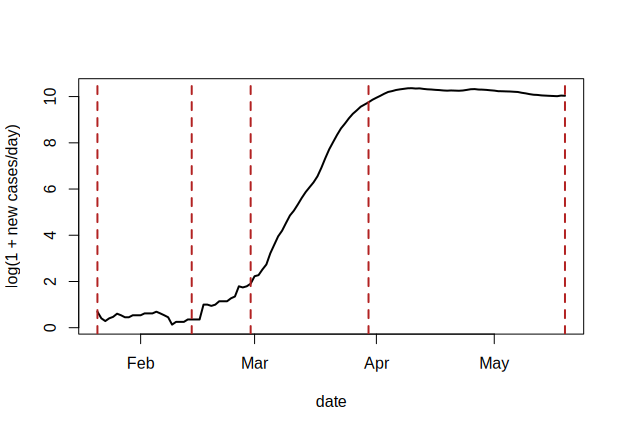
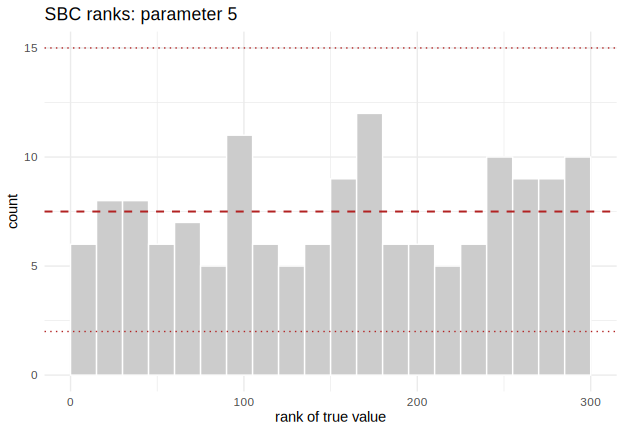
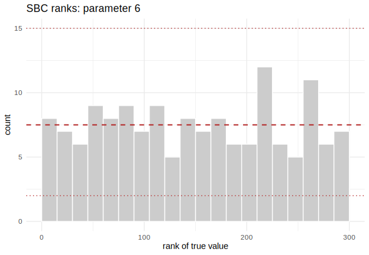
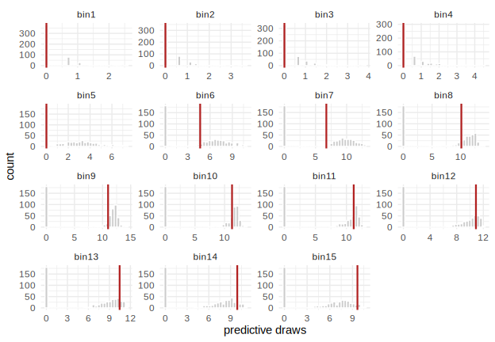
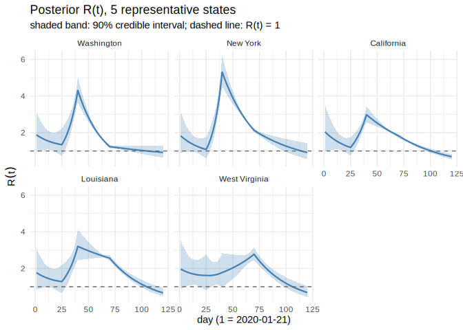
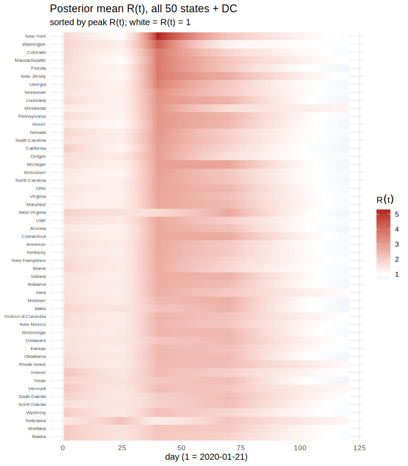

`vignette("sir-epidemic")` fits a stochastic SIR outbreak with a *constant*
contact rate \(\beta\). Real epidemics do not hold still: control measures,
behavior change, and depleting susceptibles all move the transmission rate
over the course of an outbreak. This vignette lets \(\beta\) vary with time,
\(\beta(t)\), and asks the question public-health teams actually care about:
how did the **effective reproduction number**
\(R(t) = \beta(t) / \gamma\) evolve? We answer it for all 50 US states plus
Washington, DC, over the first 120 days of the SARS-CoV-2 pandemic
(2020-01-21 to 2020-05-19), training **one** amortized posterior and
conditioning it on each state's reported-case curve in turn.

Two modeling questions have to be answered before any of that: how many
points does \(\beta(t)\) need, and where do they go? We answer both from the
data rather than by assumption.

## The data: reported cases in the first 120 days

We use the New York Times' county/state-level COVID-19 case counts, which
start on 2020-01-21 — the date of the first confirmed US case (Snohomish
County, Washington) — and US Census population estimates to convert case
counts to a proportion of each state's population.


``` r
cases_url <- "https://raw.githubusercontent.com/nytimes/covid-19-data/master/us-states.csv"
pop_url <- "https://raw.githubusercontent.com/COVID19Tracking/associated-data/master/us_census_data/us_census_2018_population_estimates_states.csv"

raw_cases <- read.csv(cases_url)
pop_table <- read.csv(pop_url)

raw_cases$date <- as.Date(raw_cases$date)
start_date <- as.Date("2020-01-21")
end_date <- start_date + 119L   # 120 days, day 1 .. day 120
window <- raw_cases[raw_cases$date >= start_date & raw_cases$date <= end_date, ]

# the 50 states + DC only -- drop territories (Puerto Rico is the only one the
# population table also carries, so it needs an explicit exclusion)
state_names <- sort(setdiff(intersect(unique(window$state), pop_table$state_name),
                            "Puerto Rico"))
window <- window[window$state %in% state_names, ]
length(state_names)
#> [1] 51
```

Daily counts are noisy (weekend reporting lulls, occasional data-revision
corrections that make the cumulative count dip). We convert each state's
cumulative series to new cases per day, clip negative revisions to zero, and
aggregate into 15 non-overlapping 8-day bins — coarse enough to smooth
weekday effects, still fine enough to trace the rise and fall of the first
wave.


``` r
n_bins <- 15L
bin_len <- 8L   # 15 * 8 = 120 days
days <- n_bins * bin_len

new_cases_binned <- function(state_df) {
  full <- data.frame(date = seq(start_date, end_date, by = "day"))
  full <- merge(full, state_df[, c("date", "cases")], by = "date", all.x = TRUE)
  full$cases[is.na(full$cases)] <- 0
  full$cases <- cummax(full$cases)             # enforce a monotone cumulative count
  new <- c(full$cases[1], diff(full$cases))
  new[new < 0] <- 0                             # data-revision artifacts
  bin <- rep(seq_len(n_bins), each = bin_len)
  as.numeric(tapply(new, bin, sum))
}

case_bins <- t(sapply(state_names, function(s) new_cases_binned(window[window$state == s, ])))
rownames(case_bins) <- state_names
pop <- stats::setNames(pop_table$population, pop_table$state_name)[state_names]
range(pop)
#> [1]   577737 39557045
```

State populations span two orders of magnitude, from Wyoming
(577,737) up to California
(39,557,045). That range matters for the simulator
below: population size is a *known* covariate, not something we infer, but
the amortized posterior still has to condition on it correctly for a
39-million-person state and a 600,000-person state alike.

The national aggregate is the curve we will use to choose \(\beta(t)\)'s
knots.


``` r
national <- aggregate(cases ~ date, data = window, sum)
national <- national[order(national$date), ]
national$new <- pmax(c(national$cases[1], diff(national$cases)), 0)
roll7 <- function(x, k = 7) sapply(seq_along(x), function(i) mean(x[max(1, i - k + 1):i]))
national$new7 <- roll7(national$new)
national$day <- as.numeric(national$date - start_date) + 1

plot(national$day, national$new7, type = "l", lwd = 2,
     xlab = "day (1 = 2020-01-21)", ylab = "new cases/day (7-day average)",
     main = "US reported cases, first 120 days")
```

<div class="figure">

<p class="caption">plot of chunk national-curve</p>
</div>

## How many knots, and where?

We model \(\log \beta(t)\) as **piecewise linear between a small number of
knots** — the simplest spline that can bend. Too few knots and \(\beta(t)\)
cannot represent the epidemic's actual shape (seeding, acceleration, control);
too many and the amortized posterior is trying to pin down parameters the
data cannot separately identify, which is exactly the overfitting SBC would
later expose as miscalibration.

We pick the number and placement by fitting a continuous piecewise-linear
(linear-spline) regression to the log of the national curve, `log(new7)`, and
selecting breakpoints by BIC — the standard bias/variance trade-off for
segmented regression. For each candidate breakpoint count \(k\), we grid-search
breakpoint locations (5-day grid) for the placement that minimizes the
residual sum of squares, and track how much BIC improves from \(k\) to
\(k+1\).


``` r
nat <- national[national$new7 > 0, ]
y <- log(nat$new7)
day <- nat$day
n_obs <- length(y)

fit_bic <- function(taus) {
  X <- cbind(1, day, sapply(taus, function(tau) pmax(day - tau, 0)))
  fit <- lm.fit(X, y)
  if (any(is.na(fit$coefficients))) return(NULL)
  rss <- sum(fit$residuals^2)
  p <- ncol(X)
  list(bic = n_obs * log(rss / n_obs) + p * log(n_obs), taus = taus)
}

cand <- seq(10, 110, by = 5)
best_by_k <- lapply(0:6, function(k) {
  if (k == 0) return(fit_bic(numeric(0)))
  combs <- combn(cand, k)
  best <- NULL
  for (j in seq_len(ncol(combs))) {
    r <- fit_bic(combs[, j])
    if (!is.null(r) && (is.null(best) || r$bic < best$bic)) best <- r
  }
  best
})

knot_table <- data.frame(
  breakpoints = 0:6,
  bic = sapply(best_by_k, `[[`, "bic"),
  taus = sapply(best_by_k, function(b) paste(b$taus, collapse = ", "))
)
knot_table$delta_bic <- c(NA, -diff(knot_table$bic))
knot_table
#>   breakpoints        bic                   taus  delta_bic
#> 1           0  135.14785                                NA
#> 2           1   27.75666                     80 107.391183
#> 3           2 -243.69618                 30, 70 271.452840
#> 4           3 -297.81147             25, 40, 70  54.115294
#> 5           4 -338.15130         15, 20, 40, 70  40.339827
#> 6           5 -363.35963     15, 20, 40, 65, 75  25.208332
#> 7           6 -366.44797 10, 15, 20, 40, 65, 75   3.088339
```

BIC keeps improving out to 6 breakpoints, so raw BIC alone does not pick a
clear winner — a second signal does. Compare the breakpoint sets themselves:
going from 2 to 3 breakpoints *refines* the previous solution ({30, 70}
becomes {25, 40, 70}, i.e. the existing breakpoints move slightly and one is
added), but going from 3 to 4 does not — {25, 40, 70} is replaced wholesale by
{15, 20, 40, 70}, dropping day 25 and inserting two breakpoints only 5 days
apart, both inside the window where national counts were in the single or
low double digits. That is the signature of a search fitting noise in small
counts rather than finding new structure: real inflections give stable
refinements as `k` grows, spurious ones cause the whole configuration to
jump. Beyond 4 breakpoints the configurations keep reshuffling in the same
way, and the marginal BIC gain (`delta_bic`) has by then dropped an order of
magnitude from its peak. We take **3 breakpoints** — 4 linear segments in
\(\log \beta(t)\) — as the last stable, well-supported fit. Combined with the
two endpoints (day 1 and day 120), that gives **5 knots**:


``` r
knot_days <- c(1, sort(best_by_k[[4]]$taus), 120)
knot_days
#> [1]   1  25  40  70 120
```

Those knots line up with the actual course of the US epidemic: day 1
(2020-01-21, the first detected case) through the low, mostly-imported count
of late January and February; an inflection around day
25 (Feb 14) as
community transmission took hold; a second inflection near day
40 (Feb 29), close
to the WHO's March 11 pandemic declaration and the first stay-at-home orders;
a third near day 70 (Mar 30),
by which point most states had issued stay-at-home orders and growth was
decelerating; and day 120 (2020-05-19), by which point the first wave had
largely plateaued nationally. We are not fitting these dates to epidemiology
by hand — they fell out of the BIC search — but they recover a shape anyone
who lived through spring 2020 will recognize.


``` r
plot(national$day, log1p(national$new7), type = "l", lwd = 2,
     xlab = "day", ylab = "log(1 + new cases/day)")
abline(v = knot_days, col = "firebrick", lty = 2)
```

<div class="figure">

<p class="caption">plot of chunk knot-plot</p>
</div>

## The model: a stochastic SIR with a piecewise-linear \(\log \beta(t)\)

The dynamics are the same discrete-time, binomial-transition SIR used in
`vignette("sir-epidemic")` — susceptible, infected, and recovered counts
update via `rbinom()`, so the process is genuinely stochastic and there is no
tractable likelihood for the reported-case curve. What is new: \(\beta\) is no
longer a scalar. At each of the 5 knots we place a free parameter
\(\log \beta_k\), and \(\log \beta(t)\) for any day \(t\) is the linear
interpolation between the two bracketing knots. The recovery rate \(\gamma\) is
**fixed**, not inferred: with only case counts (no recovery or serology data)
the generation interval is not separately identifiable from \(\beta(t)\), so
we set \(1/\gamma = 7\) days, in line with early estimates of the COVID-19
serial interval (Li et al. 2020, *NEJM*). \(R(t) = \beta(t)/\gamma\) is
therefore the *basic* reproduction ratio implied by the contact rate at time
\(t\); with cumulative incidence staying well under a few percent of any
state's population over 120 days, the susceptible-depletion correction
\(S(t)/N\) that separates \(R_0\) from the *effective* reproduction number
stays close to 1 and we do not model it separately.

Two more pieces reflect real surveillance data rather than the clean
simulated curves of the earlier vignette:

* **Ascertainment.** Only a fraction \(\rho\) of infections became a
  confirmed, reported case in spring 2020, when testing capacity was scarce.
  \(\rho\) is inferred jointly with \(\beta(t)\) rather than fixed.
* **Population size \(N\)** is a *known* covariate, not a free parameter: the
  simulator draws it from a distribution spanning the range of actual state
  populations, and the density estimator conditions on it directly (as
  \(\log N\), passed alongside the case-count data) so that one trained
  network generalizes from Wyoming to California.


``` r
library(neuralsbi)
#> 
#> Attaching package: 'neuralsbi'
#> The following object is masked from 'package:base':
#> 
#>     sample

n_knots <- length(knot_days)
gamma_fixed <- 1 / 7

prior <- prior_normal(
  mean = c(rep(log(0.3), n_knots), qlogis(0.1)),
  sd   = c(rep(0.5, n_knots), 1)
)

sir_rt_simulator <- function(theta, N_fixed = NULL) {
  theta <- matrix(as.numeric(theta), ncol = n_knots + 1L)
  n <- nrow(theta)
  log_beta_knots <- theta[, seq_len(n_knots), drop = FALSE]
  rho <- plogis(theta[, n_knots + 1])

  # population: a known covariate, drawn to span real US state sizes during
  # training and fixed to the observed state's population at inference time
  N <- if (is.null(N_fixed)) exp(stats::runif(n, log(5e5), log(4e7))) else rep(N_fixed, n)

  # piecewise-linear log-beta(t): interpolation weights depend only on the
  # knot days, so build them once and matrix-multiply across all n draws
  t_grid <- seq_len(days)
  W <- matrix(0, length(t_grid), n_knots)
  for (i in seq_along(t_grid)) {
    j <- max(which(knot_days <= t_grid[i]))
    if (j == n_knots) { W[i, j] <- 1; next }
    w <- (t_grid[i] - knot_days[j]) / (knot_days[j + 1] - knot_days[j])
    W[i, j] <- 1 - w; W[i, j + 1] <- w
  }
  beta_t <- exp(log_beta_knots %*% t(W))   # n x days

  I0 <- 1 + stats::rpois(n, 1.5)           # a handful of independent introductions
  S <- N - I0; I <- I0; R <- rep(0, n)
  new_daily <- matrix(0, n, days)
  n_sub <- 2L; dt <- 1 / n_sub
  for (t in seq_len(days)) {
    H <- rep(0, n)
    beta <- beta_t[, t]
    for (s in seq_len(n_sub)) {
      p_inf <- pmin(pmax(1 - exp(-beta * I / N * dt), 0), 1)
      p_rec <- pmin(pmax(1 - exp(-gamma_fixed * dt), 0), 1)
      dN_SI <- stats::rbinom(n, pmax(round(S), 0), p_inf)
      dN_IR <- stats::rbinom(n, pmax(round(I), 0), p_rec)
      S <- S - dN_SI; I <- I + dN_SI - dN_IR; R <- R + dN_IR
      H <- H + dN_SI
    }
    new_daily[, t] <- stats::rbinom(n, pmax(round(H), 0), rho)
  }

  bin <- rep(seq_len(n_bins), each = bin_len)
  x_bins <- t(apply(new_daily, 1, function(row) tapply(row, bin, sum)))
  cbind(log(N), log1p(x_bins))   # log(N) + 15 binned, log1p-compressed case counts
}
```

\(\theta = (\log \beta_1, \dots, \log \beta_5, \operatorname{logit} \rho)\)
is 6-dimensional and unconstrained on \(\mathbb{R}^6\) — the log/logit
transforms mean we can use a single Gaussian prior with no truncated support,
so the posterior needs no rejection sampling for leakage.

## Training the amortized posterior

One MAF is trained across the whole prior — including the full range of
state population sizes — and reused for every state below. This is what
*amortized* buys: train once, then condition on 51 different observations for
the price of a forward pass each.


``` r
fit <- npe(prior, sir_rt_simulator, n_simulations = 12000,
           density_estimator = "maf", max_epochs = 200, n_restarts = 1,
           seed = 1, verbose = FALSE)
fit
#> <nsbi_npe> Neural Posterior Estimation fit
#>   density estimator : maf
#>   parameters (dim)  : 6
#>   data (dim)        : 16
#>   simulations       : 12000
#>   best val loss     : 0.5786
#>   -> build a posterior with posterior(fit, x_obs = ...)
```

## Validate before trusting a single R(t) curve

Simulation-based calibration checks that the posterior's credible intervals
have the coverage they claim, using fresh prior draws the network never saw
during training.


``` r
sbc_res <- sbc(fit, sir_rt_simulator, n_sbc = 150, n_posterior_samples = 300, seed = 2)
sbc_res    # one uniformity p-value per parameter: 5 log-beta knots, then rho
#> <nsbi_sbc> 150 trials, 300 posterior samples each
#>   per-parameter uniformity p-values (large = calibrated):
#>     0.768  0.684  0.505  0.684  0.902  0.979
```

Two parameters are worth looking at directly: \(\log \beta\) at the final knot
(day 120 — the most policy-relevant point, closest to "now" in this window)
and the ascertainment rate \(\rho\), which is the parameter most likely to
trade off against \(\beta(t)\) if the two were poorly identified.


``` r
plot_sbc(sbc_res, param = n_knots)
```

<div class="figure">

<p class="caption">plot of chunk sbc-beta5</p>
</div>


``` r
plot_sbc(sbc_res, param = n_knots + 1)
```

<div class="figure">

<p class="caption">plot of chunk sbc-rho</p>
</div>

And a posterior predictive check against real data grounds the calibration
check in the actual observation we care about: does the fitted model, run
forward from its posterior, reproduce the shape of a real state's curve? We
check New York, the largest epicenter in this window.


``` r
x_obs_ny <- c(log(pop["New York"]), log1p(case_bins["New York", ]))
post_ny <- posterior(fit, x_obs = x_obs_ny)
sim_ny <- function(theta) sir_rt_simulator(theta, N_fixed = pop["New York"])
pred_ny <- posterior_predictive(post_ny, sim_ny, n = 500)

# drop the log(N) column: N is fixed for this state, so that facet is degenerate
plot_posterior_predictive(pred_ny[, -1], x_obs_ny[-1],
                          labels = paste0("bin", seq_len(n_bins)))
```

<div class="figure">

<p class="caption">plot of chunk post-pred-ny</p>
</div>

## R(t) for every state

For each of the 51 jurisdictions we condition the same trained posterior on
that state's own case-count curve and population, then map each posterior
draw of \(\log \beta(t)\) at the 5 knots through the piecewise-linear
interpolant to get a full 120-day \(R(t)\) trajectory.


``` r
t_grid <- seq_len(days)
W_grid <- matrix(0, length(t_grid), n_knots)
for (i in seq_along(t_grid)) {
  j <- max(which(knot_days <= t_grid[i]))
  if (j == n_knots) { W_grid[i, j] <- 1; next }
  w <- (t_grid[i] - knot_days[j]) / (knot_days[j + 1] - knot_days[j])
  W_grid[i, j] <- 1 - w; W_grid[i, j + 1] <- w
}

rt_state <- function(state, n_draws = 2000) {
  x_obs <- c(log(pop[state]), log1p(case_bins[state, ]))
  draws <- sample(posterior(fit, x_obs = x_obs), n_draws)
  log_beta_t <- draws[, seq_len(n_knots)] %*% t(W_grid)   # n_draws x days
  rt <- exp(log_beta_t) / gamma_fixed
  data.frame(state = state, day = t_grid,
             rt_mean = colMeans(rt),
             rt_lo = apply(rt, 2, stats::quantile, 0.05),
             rt_hi = apply(rt, 2, stats::quantile, 0.95))
}

rt_all <- do.call(rbind, lapply(state_names, rt_state))
```

A handful of states tell the national story: Washington (site of the first
detected US case and the Kirkland nursing-home cluster), New York (the
largest epicenter in this window), California (first state to issue a
stay-at-home order, March 19), Louisiana (a sharp early surge tied to Mardi
Gras gatherings in New Orleans), and West Virginia (the last state to report
a case, on March 17).


``` r
library(ggplot2)

highlight <- c("Washington", "New York", "California", "Louisiana", "West Virginia")
rt_highlight <- rt_all[rt_all$state %in% highlight, ]
rt_highlight$state <- factor(rt_highlight$state, levels = highlight)

ggplot(rt_highlight, aes(day, rt_mean)) +
  geom_ribbon(aes(ymin = rt_lo, ymax = rt_hi), fill = "steelblue", alpha = 0.25) +
  geom_line(colour = "steelblue", linewidth = 0.8) +
  geom_hline(yintercept = 1, linetype = 2, colour = "grey40") +
  facet_wrap(~state, ncol = 3) +
  labs(x = "day (1 = 2020-01-21)", y = expression(R(t)),
       title = "Posterior R(t), 5 representative states",
       subtitle = "shaded band: 90% credible interval; dashed line: R(t) = 1") +
  theme_minimal()
```

<div class="figure">

<p class="caption">plot of chunk rt-highlight</p>
</div>

All 51 states, condensed into one view: a heatmap of posterior-mean
\(R(t)\), states sorted by their peak reproduction number.


``` r
peak_order <- names(sort(tapply(rt_all$rt_mean, rt_all$state, max), decreasing = TRUE))
rt_all$state <- factor(rt_all$state, levels = rev(peak_order))

ggplot(rt_all, aes(day, state, fill = rt_mean)) +
  geom_raster() +
  scale_fill_gradient2(midpoint = 1, low = "steelblue", mid = "white",
                       high = "firebrick", name = expression(R(t))) +
  labs(x = "day (1 = 2020-01-21)", y = NULL,
       title = "Posterior mean R(t), all 50 states + DC",
       subtitle = "sorted by peak R(t); white = R(t) = 1") +
  theme_minimal() +
  theme(axis.text.y = element_text(size = 6))
```

<div class="figure">

<p class="caption">plot of chunk rt-heatmap</p>
</div>

The pattern matches the national narrative from the knot-selection curve:
\(R(t)\) starts near or above the epidemic threshold of 1 for the states hit
first, climbs through early-to-mid March as community transmission spreads,
and comes back down toward 1 by mid-to-late April as stay-at-home orders took
effect nearly everywhere — with real heterogeneity in timing and magnitude
that a single national \(R(t)\) estimate would have hidden.

## What amortization bought here

The alternative to amortized NPE is fitting a separate model per state — 51
particle filters, 51 MCMC chains, 51 opportunities for a chain to fail to
converge. Here, training happened once (12000 simulations,
one MAF), and every state's posterior above cost only a forward pass through
the trained network. That is the payoff `vignette("sir-epidemic")` promised in
the abstract; this vignette spends it on a real, 51-jurisdiction dataset.

The model still carries real simplifications, worth stating plainly: \(\gamma\)
is fixed rather than inferred, so `sbc()` above is calibrated conditional on
that choice, not unconditionally; every state shares the same calendar-time
knots even though the epidemic reached each one at a different moment; a
single ascertainment rate \(\rho\) stands in for what was, in practice, a
patchwork of state and local testing capacity; and importation is reduced to
a handful of seed cases on day 1 rather than a distributed process over the
following weeks. Loosening any of these is a natural next step, and each one
is a change to the simulator, not to the inference machinery around it — the
same amortized-NPE workflow applies unchanged.

For the underlying workflow in more depth, see `vignette("sir-epidemic")` and
`vignette("diagnostics")`.
